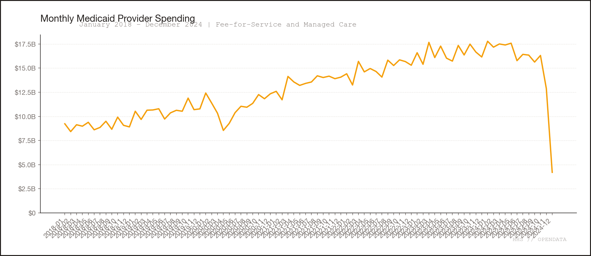

# Medicaid Claims Fraud Detection — Master Index

**Dataset:** HHS Provider Spending, January 2018 through December 2024
**Scope:** $1.09 trillion across 227M billing records, 617,503 providers, 84 months

---

## Executive Reports

| Document | Description |
|----------|-------------|
| [cms_administrator_report.md](../cms_administrator_report.md) | Full report prepared for CMS Administrator. Methodology, top findings, and recommendations. |
| [executive_brief.md](executive_brief.md) | One-page summary: top 500 leads, quality-weighted exposure, dominant signal families. |
| [action_plan_memo.md](action_plan_memo.md) | CEO action plan: 30-day priorities, policy actions, risk concentration, deliverables. |
| [top10_findings_plain.md](top10_findings_plain.md) | Top 10 provider-level findings in plain English with dollar amounts. |

---

## Fraud Pattern Analysis

| Document | Description |
|----------|-------------|
| [fraud_patterns.md](fraud_patterns.md) | Comprehensive 10-pattern analysis with provider examples, methodology, and cross-cutting observations. Technical audience. |
| [fraud_patterns_summary.md](fraud_patterns_summary.md) | Plain-language version of the 10 patterns for non-technical readers. |
| [audit_review_fraud_patterns.md](audit_review_fraud_patterns.md) | Independent audit review: 3 critical, 4 significant, 3 moderate findings. Verified claims and recommended corrections. |

---

## Sector Deep Dives

| Document | Description |
|----------|-------------|
| [ltc_nursing_home_trends.md](ltc_nursing_home_trends.md) | Long-term care and nursing home trends: facility-to-home shift, T1019 dominance, nursing home contraction, assisted living growth, spending extrapolations through 2028. |

---

## Priority Lists and Risk Queues

| Document | Description |
|----------|-------------|
| [top50_priority_list.md](top50_priority_list.md) | Top 50 investigation targets with risk scores, methods, and notes. |
| [top100_priority_list.md](top100_priority_list.md) | Top 100 investigation targets. |
| [top200_priority_list.md](top200_priority_list.md) | Top 200 investigation targets. |
| [priority_queue_with_notes.csv](priority_queue_with_notes.csv) | Full priority queue with investigator notes (CSV). |
| [priority_queue_with_notes_and_validation.csv](priority_queue_with_notes_and_validation.csv) | Priority queue with validation scores appended. |
| [risk_queue_providers_top100.csv](risk_queue_providers_top100.csv) | Top 100 provider-level risk queue (excludes systemic entries). |
| [risk_queue_providers_top500.csv](risk_queue_providers_top500.csv) | Top 500 provider-level risk queue. |
| [risk_queue_systemic_top100.csv](risk_queue_systemic_top100.csv) | Top 100 systemic/rate-level risk entries. |
| [risk_queue_systemic_top500.csv](risk_queue_systemic_top500.csv) | Top 500 systemic/rate-level risk entries. |
| [risk_queue_top100.csv](risk_queue_top100.csv) | Combined top 100 (provider + systemic). |
| [risk_queue_top500.csv](risk_queue_top500.csv) | Combined top 500 (provider + systemic). |

---

## Methodology and Calibration

| Document | Description |
|----------|-------------|
| [current_analysis_pack.md](current_analysis_pack.md) | Analysis summary: finding counts by confidence tier, top states, top methods, top 20 risk queue. |
| [calibration_report.md](calibration_report.md) | Holdout + placebo calibration: most stable/unstable methods, LEIE overlap rates. |
| [hypothesis_validation_summary.md](hypothesis_validation_summary.md) | 1,087 hypotheses tested: 481 supported, 606 unsupported. Totals by method. |
| [longitudinal_multivariate_report.md](longitudinal_multivariate_report.md) | Time-range overview: top states, specialties, HCPCS codes by total paid. |
| [pruned_methods.csv](pruned_methods.csv) | Four methods removed for instability. |
| [method_calibration.csv](method_calibration.csv) | Per-method holdout rates and z-delta scores. |
| [positive_control_overlaps.csv](positive_control_overlaps.csv) | LEIE overlap rates per detection method. |

---

## Data Tables

| File | Description |
|------|-------------|
| [monthly_totals.csv](monthly_totals.csv) | Monthly spending totals (Jan 2018 – Dec 2024). |
| [state_monthly_totals.csv](state_monthly_totals.csv) | Spending by state and month. |
| [specialty_monthly_totals.csv](specialty_monthly_totals.csv) | Spending by provider specialty and month. |
| [code_monthly_totals_top200.csv](code_monthly_totals_top200.csv) | Top 200 HCPCS codes by month. |
| [growth_anomalies_top500.csv](growth_anomalies_top500.csv) | Year-over-year growth anomalies for top 500 providers. |
| [ppc_residuals_top500.csv](ppc_residuals_top500.csv) | Paid-per-claim residuals for top 500 providers. |
| [multivariate_risk_top500.csv](multivariate_risk_top500.csv) | Multivariate risk scores for top 500 providers. |
| [provider_validation_scores.csv](provider_validation_scores.csv) | Validation scores for all flagged providers (35 MB). |

---

## Visualizations

All charts are in `output/charts/`. 43 PNG files total.

### Overview Charts

| Chart | Description |
|-------|-------------|
| [monthly_spending_trend.png](../charts/monthly_spending_trend.png) | Total Medicaid spending by month, Jan 2018 – Dec 2024. |
| [top20_providers.png](../charts/top20_providers.png) | Top 20 providers by total paid. |
| [top20_procedures.png](../charts/top20_procedures.png) | Top 20 HCPCS procedure codes by total paid. |
| [lorenz_curve.png](../charts/lorenz_curve.png) | Spending concentration (Lorenz curve). |
| [hhs_examples_full_page.png](../charts/hhs_examples_full_page.png) | HHS dataset page reference. |

### Card Views (Summary)

| Chart | Description |
|-------|-------------|
| [card1_monthly_spending.png](../charts/card1_monthly_spending.png) | Monthly spending trend (card format). |
| [card2_top_procedures.png](../charts/card2_top_procedures.png) | Top procedures (card format). |
| [card3_top_providers.png](../charts/card3_top_providers.png) | Top providers (card format). |

### Fraud Detection Charts

| Chart | Description |
|-------|-------------|
| [top20_flagged_providers.png](../charts/top20_flagged_providers.png) | Top 20 providers by risk score. |
| [top20_flagged_procedures.png](../charts/top20_flagged_procedures.png) | Top 20 flagged procedure codes. |
| [findings_by_category.png](../charts/findings_by_category.png) | Finding distribution by analytical category. |
| [provider_risk_scatter.png](../charts/provider_risk_scatter.png) | Provider risk scatter plot (methods vs. exposure). |
| [state_heatmap.png](../charts/state_heatmap.png) | Risk exposure by state (heat map). |
| [benfords_law.png](../charts/benfords_law.png) | Benford's law analysis of billing amounts. |
| [network_graph_top3.png](../charts/network_graph_top3.png) | Network graph of top 3 billing networks. |
| [temporal_anomalies_top5.png](../charts/temporal_anomalies_top5.png) | Temporal anomaly patterns for top 5 flagged providers. |

### Fraud Heatmaps

| Chart | Description |
|-------|-------------|
| [fraud_heatmap_final.png](../charts/fraud_heatmap_final.png) | Fraud pattern intensity matrix (final version). |
| [fraud_heatmap_aligned.png](../charts/fraud_heatmap_aligned.png) | Fraud heatmap with aligned spending/risk columns. |
| [fraud_heatmap_merged.png](../charts/fraud_heatmap_merged.png) | Merged spending + risk heatmap. |
| [fraud_heatmap_v1.png](../charts/fraud_heatmap_v1.png) | Fraud heatmap (initial version). |

### Individual Finding Time Series (Top 20)

| Chart | Finding |
|-------|---------|
| [finding_F001_timeseries.png](../charts/finding_F001_timeseries.png) | F001: LA County DMH |
| [finding_F002_timeseries.png](../charts/finding_F002_timeseries.png) | F002: TN DIDD (NPI ...6241) |
| [finding_F003_timeseries.png](../charts/finding_F003_timeseries.png) | F003: Alabama DMH |
| [finding_F004_timeseries.png](../charts/finding_F004_timeseries.png) | F004: TN DIDD (NPI ...9976) |
| [finding_F005_timeseries.png](../charts/finding_F005_timeseries.png) | F005: GuardianTrac LLC |
| [finding_F006_timeseries.png](../charts/finding_F006_timeseries.png) | F006: City of Chicago |
| [finding_F007_timeseries.png](../charts/finding_F007_timeseries.png) | F007: MA DDS (NPI ...4064) |
| [finding_F008_timeseries.png](../charts/finding_F008_timeseries.png) | F008: NJ Health & Senior Services |
| [finding_F009_timeseries.png](../charts/finding_F009_timeseries.png) | F009: Mains'l Florida |
| [finding_F010_timeseries.png](../charts/finding_F010_timeseries.png) | F010: New Partners Inc |
| [finding_F011_timeseries.png](../charts/finding_F011_timeseries.png) | F011: Commonwealth of MA |
| [finding_F012_timeseries.png](../charts/finding_F012_timeseries.png) | F012: Commonwealth of Mass-DDS |
| [finding_F013_timeseries.png](../charts/finding_F013_timeseries.png) | F013: CARE Inc |
| [finding_F014_timeseries.png](../charts/finding_F014_timeseries.png) | F014: TN Children's Services |
| [finding_F015_timeseries.png](../charts/finding_F015_timeseries.png) | F015: Commonwealth of MA-DDS |
| [finding_F016_timeseries.png](../charts/finding_F016_timeseries.png) | F016: Consumer Direct Care Network VA |
| [finding_F017_timeseries.png](../charts/finding_F017_timeseries.png) | F017: County of Orange |
| [finding_F018_timeseries.png](../charts/finding_F018_timeseries.png) | F018: County of Sacramento |
| [finding_F019_timeseries.png](../charts/finding_F019_timeseries.png) | F019: Public Partnerships-Colorado |
| [finding_F020_timeseries.png](../charts/finding_F020_timeseries.png) | F020: Youth Villages Inc |

### Interactive

| File | Description |
|------|-------------|
| [fraud_heatmap.html](fraud_heatmap.html) | Interactive HTML fraud pattern heatmap with merged spending + risk columns. |

---

## Key Numbers at a Glance

| Metric | Value |
|--------|-------|
| Total Medicaid spending (2018–2024) | $1,093,562,833,513 |
| Total billing records analyzed | 227,083,361 |
| Individual claim transactions | 18,825,564,012 |
| Providers analyzed | 617,503 |
| Provider-level standardized exposure | $354,986,926,844 |
| Systemic rate/code exposure | $116,147,010,551 |
| Quality-weighted provider exposure | $325,267,268,838 |
| High-confidence findings | 10,913 |
| Medium-confidence findings | 19,379 |
| Low-confidence findings | 560,889 |
| Detection methods (after pruning) | ~60 active methods |
| Methods pruned for instability | 4 |
| Top provider exposure: LA County DMH | $4,985,377,850 |
| Largest single HCPCS code: T1019 | $122,739,547,514 (11.2% of total) |
| LTC sector total (2018–2024) | $191.2B (17.5% of total) |
| LTC annual growth rate (CAGR 2018–2023) | 17.9% |

---

## Pattern Summary (Quick Reference)

| # | Pattern | Provider Exposure | Providers | Key Insight |
|---|---------|-------------------|-----------|-------------|
| 1 | Home Health & Personal Care | $55.0B | 19,922 | T1019 = 11.2% of all Medicaid; NY agencies dominate |
| 2 | Middleman Billing | $36.5B | 1,915 | GuardianTrac: 15 methods, $1.24B exposure |
| 3 | Government Agency Outliers | $53.5B | 20,205 | 11 of top 20 are public entities — policy, not fraud |
| 4 | Providers That Cannot Exist | $0.9B + $116.1B systemic | 407 | 3 unregistered IDs billed in 24-30 states |
| 5 | Billing Every Day | $9.6B | 20 | Weak standalone signal; strong corroborator |
| 6 | Sudden Starts & Stops | $91.8B | 2,433 | Largest by dollar; Dec 2024 data caveat applies |
| 7 | Billing Networks | $16.1B | 852 | Mains'l Florida: 81x rate markup |
| 8 | State Rate Differences | $77.5B systemic | 20 combos | NY T1019: 2.1x national median |
| 9 | Upcoding & Impossible Volumes | $3.4B | 36 | Major hospital systems need chart review, not fraud referral |
| 10 | Shared Beneficiary Counts | $2.4B | 19 | CARE Inc (NY): 240,183 matching benes |

---

## Audit Findings (from audit_review_fraud_patterns.md)

**3 Critical:**
1. "227 million claims" should be "227 million billing records"
2. Estimated impacts exceed actual billing by 2-6x for top providers
3. 29% of top-500 exposure is state/code-level, not provider fraud

**4 Significant:**
4. Pattern 4 count/dollar not reproducible from pipeline
5. Per-pattern dollar totals cannot be independently verified
6. December 2024 incomplete data creates false positives
7. Positive control validation was never completed

**3 Moderate:**
8. Impact calculation methodology inconsistent across methods
9. Calibration baseline is not a precision metric
10. Confidence tier definitions inconsistent across reports
