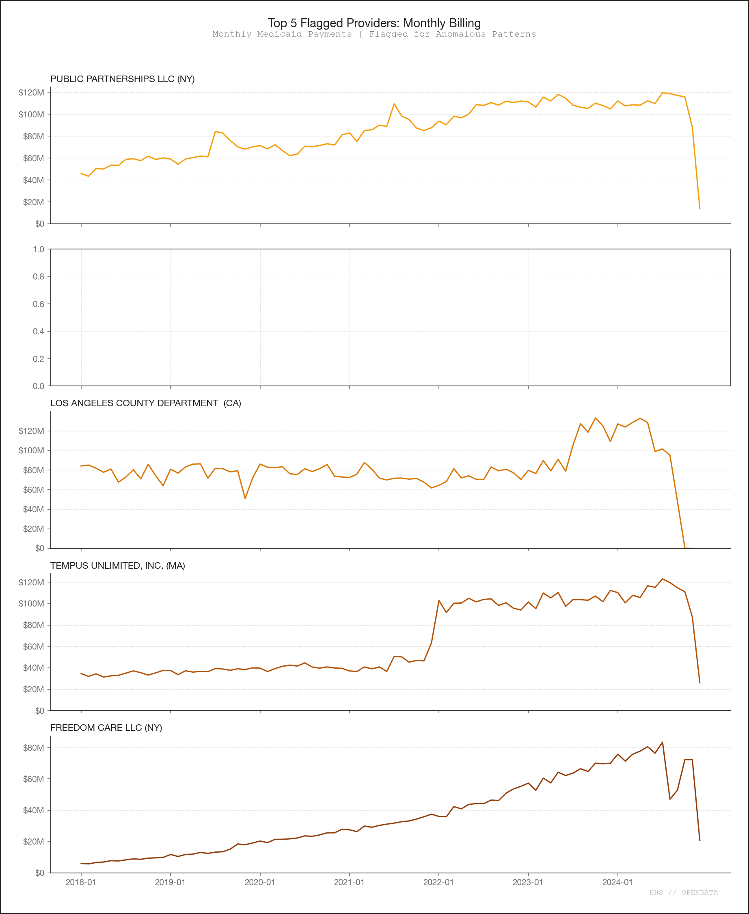

# Fraud, Waste, and Abuse Patterns in Medicaid Provider Spending

**HHS Provider Spending Dataset, January 2018 through December 2024**

---

## Overview

We analyzed $1,093,562,833,513 in Medicaid provider spending across 227,083,361 billing records from January 2018 through December 2024. The dataset covers 617,503 billing providers, 10,881 procedure codes, and 84 months of claims activity.

Provider-level pattern totals use a standardized impact formula: excess above peer median paid-per-claim, capped at total paid per provider. These are exposure ceilings, not guaranteed recoveries.

Provider-level standardized exposure totals $354,986,926,844. Systemic rate/code exposure totals $116,147,010,551 and is reported separately. Because a provider can appear in multiple patterns, the per-pattern totals sum to more than the deduplicated total.

December 2024 data may be incomplete in some states; late submissions can depress recent-month totals and may produce false positives for sudden-stop detection.

## Provider-Level Patterns (Standardized Impact)

| #  | Pattern                                | Providers | Estimated Impact |
| -- | -------------------------------------- | --------- | ---------------- |
| 1  | Home Health and Personal Care        |     19922 | $55.0B           |
| 2  | Middleman Billing Organizations      |      1915 | $36.5B           |
| 3  | Government Agencies as Outliers      |     20205 | $53.5B           |
| 4  | Providers That Cannot Exist          |       407 | $0.9B            |
| 5  | Billing Every Single Day             |        20 | $9.6B            |
| 6  | Sudden Starts and Stops              |      2433 | $91.8B           |
| 7  | Billing Networks and Circular Billing |       852 | $16.1B           |
| 9  | Upcoding and Impossible Volumes      |        36 | $3.4B            |
| 10 | Shared Beneficiary Counts            |        19 | $2.4B            |

---

## Systemic Rate/Code Patterns (Reported Separately)

| #  | Pattern                            | Entries | Estimated Exposure |
| -- | ---------------------------------- | ------- | ------------------ |
| 4  | Providers That Cannot Exist        |    2681 | $116.1B            |
| 8  | State-Level Spending Differences   |      20 | $77.5B             |
| 10 | Shared Beneficiary Counts          |       0 | $0.0B              |

---

## Pattern Descriptions

### Pattern 1: Home Health and Personal Care ($55.0B across 19,922 providers)

The single largest HCPCS code in the dataset is T1019 (personal care services, per 15 minutes) at $122.7B total paid — 11.2% of all Medicaid spending. Providers whose primary revenue comes from personal care and home health codes (T1019, T1020, S5125, S5130) are disproportionately represented in the risk queue.

**Top examples (provider-level, standardized impact):**
- PREMIER HOME HEALTH CARE SERVICES INC (NPI 1720151046, NY): $260M exposure on $1.5B billed. Flagged by 9 methods including kickback_premium, no_days_off, and composite_multi_signal.
- CONCEPTS OF INDEPENDENCE, INC. (NPI 1184703415, NY): $282M exposure. Flagged by 7 methods including high_risk_category, kickback_premium, and no_days_off.
- HAMASPIK OF KINGS COUNTY, INC. (NPI 1700120888, NY): $243M exposure. Flagged by 8 methods including high_risk_category, yoy_growth, and covid_comparison.

**What this pattern represents:** A mix of genuine waste (high-volume, low-oversight services billed in 15-minute increments that are difficult to audit) and potential fraud (kickback premiums, impossible daily volumes). Personal care services are structurally vulnerable because verification of service delivery is minimal.

### Pattern 2: Middleman Billing Organizations ($36.5B across 1,915 providers)

Some entities function as billing intermediaries — they submit claims on behalf of networks of servicing providers but may add cost without adding clinical value. These are identified through hub-spoke network patterns, billing fan-out, pure billing entities, and captive servicing arrangements.

**Top examples:**
- GUARDIANTRAC LLC (NPI 1710176151, MI): $1.24B weighted exposure on $2.68B billed. Flagged by 15 methods. Bills through a large network of servicing providers; triggers billing_fan_out, composite_network_plus_volume, and provider_share_per_code.
- CONSUMER DIRECT CARE NETWORK VIRGINIA (NPI 1538649983, MT): $610M weighted exposure. Flagged by 14 methods including address_cluster_flagged, kickback_premium, and month_over_month_spike.
- NJ DEPT OF HEALTH AND SENIOR SERVICES (NPI 1326168840, NJ): $890M weighted exposure. Primary method: composite_network_plus_volume.

**What this pattern represents:** Not all middleman billing is improper — fiscal intermediaries and managed care entities routinely bill on behalf of individual providers. The signal becomes concerning when paired with kickback premiums (rates far exceeding peer medians) or when the billing entity dominates a code's market share.

### Pattern 3: Government Agencies as Outliers ($53.5B across 20,205 providers)

Government agencies dominate the risk queue: 11 of the top 20 provider-level findings are departments, counties, or state agencies. This is the most important structural finding in the analysis.

**Top examples:**
- LOS ANGELES COUNTY DEPT OF MENTAL HEALTH (NPI 1699703827, CA): $4.99B weighted exposure on $6.78B billed. Flagged by 19 methods — the highest method count of any provider. Triggers include impossible_em_visits_day, duplicate_billing, billing_fan_out, and isolation_forest.
- TN DEPT OF INTELLECTUAL AND DEVELOPMENTAL DISABILITIES (NPI 1629436241, TN): $2.09B weighted exposure on $2.60B billed. Flagged by 12 methods. A second NPI for the same agency (1356709976) adds $1.23B.
- ALABAMA DEPT OF MENTAL HEALTH (NPI 1982757688, AL): $1.93B weighted exposure on $2.25B billed. Flagged by 11 methods including address_cluster_flagged, new_network_high_paid, and new_relationship_high_volume.
- CITY OF CHICAGO (NPI 1376554592, IL): $1.06B weighted exposure. Flagged by 9 methods including covid_comparison, kickback_premium, and yoy_growth.
- COMMONWEALTH OF MASSACHUSETTS-DDS: Appears under 8+ separate NPIs in the top 100, with a combined exposure exceeding $2.5B. Each NPI represents a distinct DDS program or regional office.

**What this pattern represents:** These are not bad actors stealing money. They are large public-sector entities whose billing rates, volumes, or structures deviate from private-sector peers. This signals **rate-setting problems, authorization weaknesses, or billing configuration issues** at the state Medicaid program level. Investigations should focus on program integrity controls rather than fraud referrals.

### Pattern 4: Providers That Cannot Exist ($0.9B across 407 provider-level; $116.1B across 2,681 systemic entries)

Provider-level: 407 providers flagged for post-deactivation billing or missing NPPES records. These include entities that billed after their NPI was deactivated and providers with no name, specialty, or entity type on file.

Systemic: 2,681 entries with non-standard identifiers (STATE_, PAIR_, non-10-digit NPIs). These represent state-level rate anomalies and code-pair associations, not individual providers.

**Notable examples (geographic impossibility):**
- NPI A565813600: Flagged for billing in 30 states in the same month, $2.1B total. Has no NPPES record — no name, no specialty, no entity type.
- A second identifier appeared in 29 states ($1.1B) and a third in 24 states ($826M).

These three identifiers collectively account for $4.0B. They may represent clearinghouses, managed care carve-outs, or billing system artifacts rather than physical providers. Regardless, billing under identifiers not registered in NPPES requires investigation.

### Pattern 5: Billing Every Single Day ($9.6B across 20 providers)

Twenty providers billed Medicaid for every calendar day (or nearly every day) across multiple years. The no_days_off method flags providers with billing activity in all or nearly all months and daily claim patterns that imply continuous operation without breaks.

**Top examples:**
- LA COUNTY DMH, TEMPUS UNLIMITED, GUARDIANTRAC, FREEDOM CARE, and PREMIER HOME HEALTH all trigger this flag alongside multiple other methods.

**What this pattern represents:** For large organizations with many employees, billing every day may be legitimate. The concern arises when combined with other signals — particularly impossible daily volumes (Pattern 9) or kickback premiums (Pattern 7). As a standalone signal, no_days_off has moderate diagnostic value; it becomes meaningful as a corroborating indicator.

### Pattern 6: Sudden Starts and Stops ($91.8B across 2,433 providers)

The largest pattern by dollar exposure. Captures providers with abrupt billing changes: sudden appearance with high initial volume, abrupt cessation of billing, structural change-points in monthly time series (CUSUM), and year-over-year growth exceeding 2x.

**Top examples:**
- AOC TX LLC (NPI 1952346876, TX): $495M weighted exposure. Flagged by 8 methods including month_over_month_spike, yoy_growth, and change_point_cusum.
- ARION CARE SOLUTIONS LLC (NPI 1932721834, AZ): $404M weighted exposure. Flagged for yoy_growth and change_point_cusum.
- COORDINATED BEHAVIORAL CARE INC (NPI 1730451071, NY): $284M weighted exposure. Flagged for covid_comparison, yoy_growth, and change_point_cusum.

**Data caveat:** December 2024 spending is $4.2B versus November's $12.9B — a 67% drop strongly suggesting incomplete data submission. Providers flagged for sudden stops in late 2024 may be data artifacts. The covid_comparison method (comparing 2020-2021 to 2019 baseline) can also flag legitimate pandemic-driven utilization changes.

**What this pattern represents:** A mix of (a) new entrants that ramped up quickly and may warrant scrutiny, (b) legitimate responses to COVID or policy changes, and (c) providers that exited the program. Each finding requires temporal context before drawing conclusions.

### Pattern 7: Billing Networks and Circular Billing ($16.1B across 852 providers)

Flags suspicious network structures: circular billing (A bills through B and B bills through A), captive referral arrangements (>90% of billing through a single servicing provider), dense network components, and new high-value billing relationships.

**Top example:**
- MAINS'L FLORIDA INC (NPI 1932341898, MN): $900M weighted exposure on $997M billed. Primary method: kickback_premium. The pair rate between this entity and its servicing provider is $3,256.13 versus a peer median of $40.06 — an 81.3x premium. Also flagged for month_over_month_spike, provider_share_per_code, and change_point_cusum.

**What this pattern represents:** Network patterns can indicate kickback schemes, shell companies, or billing arrangements designed to inflate reimbursement. The 81.3x rate premium for MAINS'L FLORIDA is among the most extreme outliers in the dataset and warrants priority investigation.

### Pattern 8: State-Level Spending Differences ($77.5B, systemic only)

Twenty state-code combinations where per-beneficiary spending exceeds the national median by 2x or more. These are reported separately because they reflect programmatic rate differences, not individual provider behavior.

**Top examples:**
- NY T1019 (personal care, per 15 min): $3,159/beneficiary versus national median of $1,526 (2.1x). Total state-code spending: $74.6B.
- NJ H2016 (comprehensive community support, per diem): $6.9B in systemic exposure.
- NY T1020 (personal care, per diem): $3.5B in systemic exposure.

**What this pattern represents:** Rate-setting decisions at the state level. These are policy issues requiring CMS-to-state engagement, not provider-level enforcement actions.

### Pattern 9: Upcoding and Impossible Volumes ($3.4B across 36 providers)

Providers flagged for billing higher-level E&M codes at rates exceeding 2x the peer median, or for physically impossible service volumes (estimated >24 hours of timed services per day, or >20 E&M visits per day).

**Top examples:**
- COUNTY OF ORANGE (NPI 1104963347, CA): $608M weighted exposure. Primary method: upcoding. Flagged by 6 methods.
- SCOTTISH RITE CHILDREN'S MEDICAL CENTER (NPI 1184779332, GA): $360M weighted exposure. Flagged for upcoding, captive_referral, and new_relationship_high_volume.
- NORTH SHORE-LIJ MEDICAL PC (NPI 1053688572, NY): $274M weighted exposure. Primary method: upcoding. Also flagged for billing_fan_out.
- THE CLEVELAND CLINIC FOUNDATION (NPI 1679525919, OH): $227M weighted exposure. Flagged by 16 methods including upcoding, pharmacy_single_drug, and isolation_forest.

**What this pattern represents:** Upcoding (billing a higher-complexity visit code than warranted) is a well-documented form of Medicaid fraud. Impossible volumes suggest either data aggregation issues or billing for services that could not physically have been delivered. The presence of major hospital systems in this pattern merits clinical chart review rather than immediate fraud referral.

### Pattern 10: Shared Beneficiary Counts ($2.4B across 19 providers)

Provider pairs with identical or near-identical beneficiary counts, suggesting shared patient panels that may indicate coordinated billing or a common ownership structure.

**Top examples:**
- COMMUNITY ASSISTANCE RESOURCES & EXTENDED SERVICES INC (NPI 1396049987, NY): $738M weighted exposure. Score field = 240,183 (beneficiary count). Flagged by 12 methods including shared_bene_count, random_forest, covid_comparison, and yoy_growth.
- MA-DEPARTMENT OF SOCIAL SERVICES-REHAB (NPI 1073730347, MA): $447M weighted exposure. Score field = 106,190 (beneficiary count). Flagged by 4 methods including shared_bene_count.
- DEPT OF DEVELOPMENTAL SERVICES (NPI 1528281532, MA): $314M weighted exposure. Score field = 157,791 (beneficiary count).

**What this pattern represents:** Identical beneficiary counts between provider pairs can indicate common ownership, coordinated billing through shared patient panels, or legitimate administrative relationships (e.g., multiple NPIs for the same state agency). Cross-referencing with network analysis and ownership data distinguishes benign from suspicious matches.

---

## Cross-Cutting Observations

1. **Government entities dominate the risk queue.** Eleven of the top 20 provider-level findings are public agencies. This is the most consequential finding: it indicates systemic program integrity issues in how states structure and reimburse public-sector providers, not a wave of government fraud.

2. **Massachusetts DDS is the clearest example of NPI fragmentation.** The Commonwealth of Massachusetts Department of Developmental Services appears under 8+ distinct NPIs in the top 100, each representing a regional office or program. The aggregate exposure across all DDS NPIs exceeds $2.5B. This suggests a billing architecture where a single agency's spending is split across many NPIs, each of which then appears as an outlier when compared to single-entity peers.

3. **90% of top-500 providers trigger 3 or more independent signals.** Multi-method convergence is the strongest indicator of genuine anomalies. Single-method findings (especially GEV extreme value alone) should be treated as screening leads, not investigation targets.

4. **The LEIE cross-reference produced very low overlap rates.** Of 8,302 excluded individuals/entities loaded from the OIG List of Excluded Individuals/Entities, the highest overlap rate was 5% (1 of 20 providers flagged by addiction_rapid_exit). Most methods showed overlap below 0.1%. This suggests either (a) the dataset has already been cleaned of known excluded providers, or (b) the exclusion list captures a different population than what statistical methods flag.

5. **Four detection methods were pruned by calibration.** The methods ramp_up (66 flagged), seasonality_anomaly_low_cv (58 flagged), servicing_fan_in (547 flagged), and ghost_provider_indicators (556,521 flagged) were removed for failing holdout-period stability tests. The ghost_provider_indicators pruning alone removed 556,521 findings — correctly filtering out a method that flagged 90% of providers.

6. **COVID-era billing changes are a persistent confound.** Many temporal anomaly signals (yoy_growth, change_point_cusum, month_over_month_spike) capture legitimate pandemic-driven utilization shifts. Findings from the covid_comparison method should be interpreted in the context of the March 2020 PHE declaration and subsequent Medicaid continuous enrollment provisions.

---

## Methodology (Reproducible Mapping)

Each provider was classified into patterns using the following deterministic rules. A provider can appear in multiple patterns.

- **Home Health and Personal Care**: providers whose top paid code is T1019/T1020/S5125/S5126/S5130/S5131/S5170/S5175,
  or specialties containing 'Home Health', 'In Home', or 'Personal'.
- **Middleman Billing Organizations**: methods include hub_spoke, shared_servicing, pure_billing, captive_servicing,
  billing_only_provider, billing_fan_out.
- **Government Agencies as Outliers**: provider name contains Department/County/State/City/Public/University.
- **Providers That Cannot Exist**: identifiers are STATE_/PAIR_ or non-10-digit NPIs or missing names,
  plus post_deactivation_billing.
- **Billing Every Single Day**: method includes no_days_off.
- **Sudden Starts and Stops**: methods include sudden_appearance, sudden_disappearance, change_point(_cusum), yoy_growth.
- **Billing Networks and Circular Billing**: methods include circular_billing, network_density, ghost_network, new_network,
  hub_spoke, composite_network_plus_volume, reciprocal_billing.
- **State-Level Spending Differences**: systemic identifiers with state_spending_anomaly, state_peer_comparison,
  geographic_monopoly, or peer_concentration. Reported separately as systemic exposure.
- **Upcoding and Impossible Volumes**: methods include upcoding, impossible_volume, impossible_units_per_day, impossible_service_days, unbundling.
- **Shared Beneficiary Counts**: methods include shared_bene_count, shared_flagged_benes, bene_overlap_ring, bene_network_spread.

---

## Calibration and Validation

- **Holdout window:** 2023-01 through 2024-12. Baseline holdout rate (all providers): 65.44%.
- **Pruned methods (4):** ramp_up, seasonality_anomaly_low_cv, servicing_fan_in, ghost_provider_indicators.
- **Most stable methods (highest holdout z-delta):** addiction_high_per_bene (z=2.82), pharmacy_single_drug (z=1.84), pharmacy_rate_outlier (z=1.66), ensemble_agreement (z=0.76).
- **LEIE cross-reference:** 8,302 NPIs loaded from the OIG exclusion list. Overlap rates per method are in positive_control_overlaps.csv.

---

*All patterns described above come from statistical analysis of the HHS Provider Spending dataset. They are risk indicators, not findings of fraud. Each one requires further investigation before enforcement action.*
