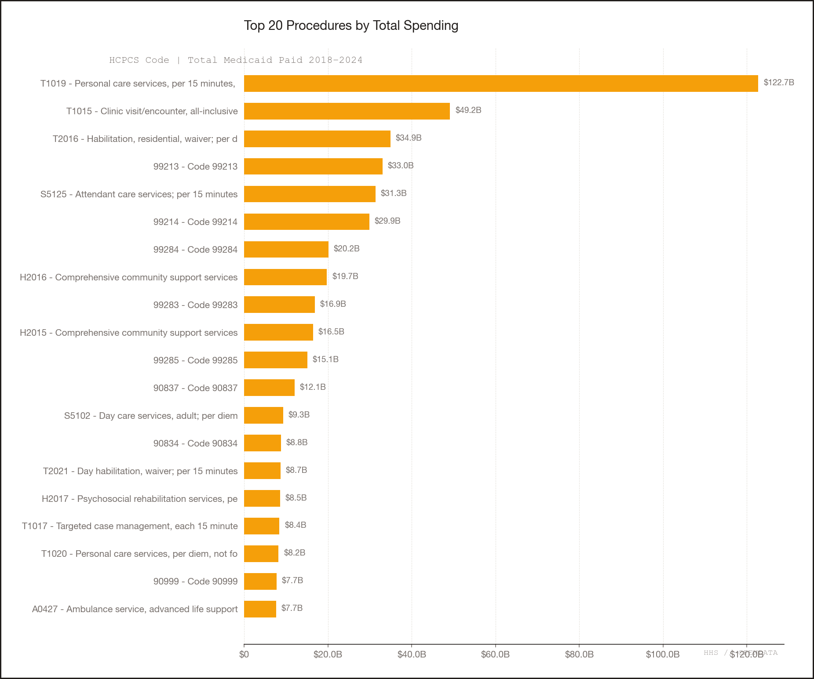
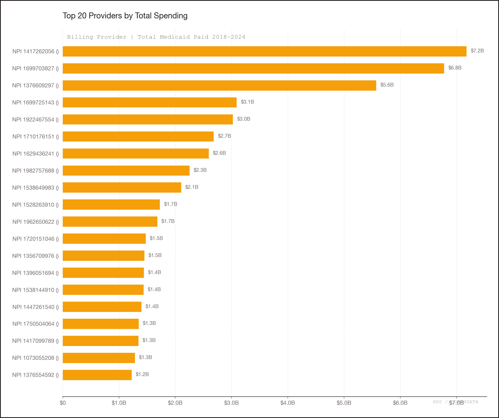
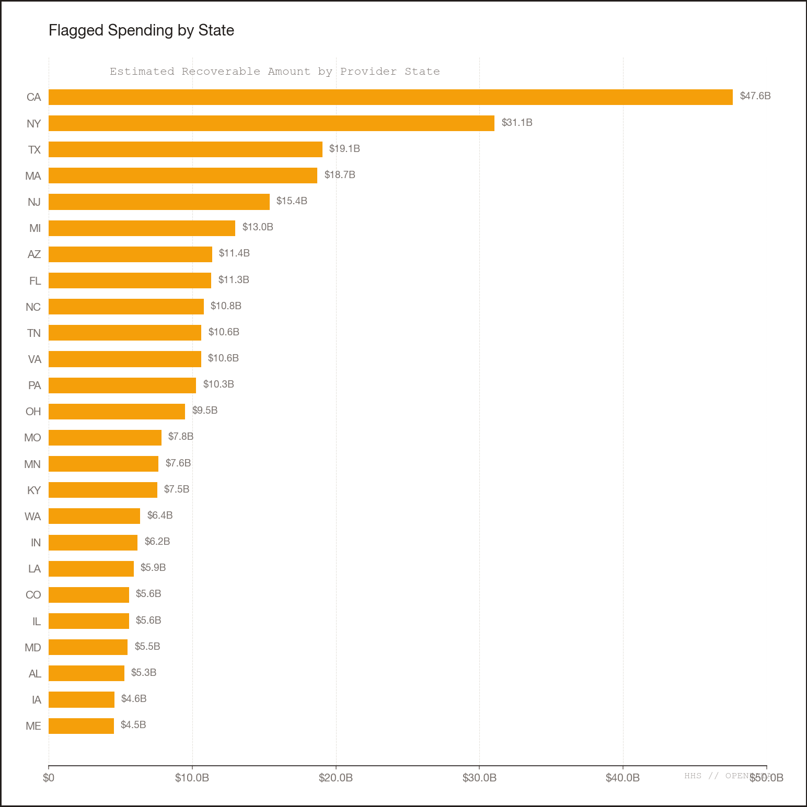

# Long-Term Care & Nursing Home: Data Trends and Extrapolations

**HHS Provider Spending Dataset, January 2018 through December 2024**

---

## The Big Picture

From the HHS Provider Spending dataset (Jan 2018 – Dec 2024), the long-term care sector — encompassing nursing homes, nursing facilities, SNFs, home health agencies, in-home supportive care, assisted living, hospice, and custodial care — accounts for **$191.2 billion, or 17.5% of all Medicaid spending** ($1.09 trillion total).

Spending more than doubled from **$15.5B in 2018 to $35.2B in 2023**, a compound annual growth rate (CAGR) of **17.9%**. 2024 data ($36.1B) appears incomplete due to late submissions (December 2024 dropped 67% from November).

---

## Trend 1: The Decisive Shift from Facility to Home-Based Care

This is the most significant structural trend in the data:

| Year | Facility-Based (NH/NF/SNF) | Home-Based (HHA + In-Home) | ALF | Hospice |
|------|----------------------------|---------------------------|-----|---------|
| 2018 | **13.8%** of LTC spending | **77.3%** | 3.4% | 5.5% |
| 2020 | 10.7% | 81.6% | 3.3% | 4.4% |
| 2023 | 9.8% | 82.5% | 4.0% | 3.7% |
| 2024 | **8.3%** | **83.9%** | 4.2% | 3.5% |

Facility-based nursing home spending dropped from 13.8% to 8.3% of LTC dollars in just 6 years. Home-based care (home health + in-home supportive care) grew from 77% to 84%. This reflects a national policy push toward home and community-based services (HCBS) over institutional settings — but it also creates oversight challenges, since in-home services are structurally harder to verify.

---

## Trend 2: Home Health Spending Growth is Explosive

| Year | Home Health + In-Home Total | YoY Growth | Active Providers |
|------|---------------------------|------------|-----------------|
| 2018 | $11.9B | — | 7,775 |
| 2019 | $16.5B | **+38.3%** | 8,339 |
| 2020 | $20.1B | +22.1% | 9,213 |
| 2021 | $23.1B | +14.9% | 9,655 |
| 2022 | $25.2B | +8.8% | 9,848 |
| 2023 | $28.9B | +15.0% | 10,194 |
| 2024 | $30.2B* | +4.5%* | 10,443 |

Home health agency spending alone went from $10.3B (2018) to $24.2B (2023), with cost-per-claim rising from $98 to $127 and cost-per-beneficiary from $1,130 to $1,748. The provider count grew by 34% (6,230 to 8,063). The 2024 apparent slowdown (+4.5%) is likely a data lag artifact.

**Extrapolation:** At the 2018–2023 CAGR of 17.9%, the LTC sector would reach **$49B by 2025**, **$58B by 2026**, and **$80B by 2028**.

---

## Trend 3: Facility-Based Nursing Homes Are Shrinking

Nursing Home + Nursing Facility + SNF combined:

| Year | Total Paid | Providers | $/Claim | $/Bene |
|------|-----------|-----------|---------|--------|
| 2018 | $2.13B | 4,365 | $80.55 | $255.65 |
| 2020 | $2.64B | 4,866 | $88.86 | $380.69 |
| 2023 | $3.43B | 4,594 | $103.05 | $358.27 |
| 2024 | $2.97B* | 3,843* | $105.65 | $368.30 |

Provider count peaked at 5,102 in 2021 and has declined to 3,843 in 2024 — a **25% drop in active nursing home providers** in three years. Cost per claim rose 32% ($80 to $106), suggesting higher acuity or rate increases for the remaining facilities. The COVID era (2020) shows a sharp spike in per-beneficiary cost ($381 vs. $256 in 2018) as volumes dropped but costs rose — many nursing homes lost residents to COVID deaths and families shifted to home care.

Tennessee dominates nursing home spending ($5.2B, 28% of all nursing home dollars) due to the Department of Intellectual and Developmental Disabilities billing under "Nursing Home" taxonomy — two of the top 5 flagged providers in the entire dataset.

---

## Trend 4: Personal Care Services (T1019) — The Largest Single LTC Code

T1019 (personal care, 15-minute increments) alone accounts for **$122.7B** — 11.2% of ALL Medicaid spending and more than all facility-based nursing homes combined:

| Year | T1019 Spending | Benes | $/Bene | YoY |
|------|---------------|-------|--------|-----|
| 2018 | $9.7B | 5.9M | $1,630 | — |
| 2019 | $13.8B | 7.4M | $1,874 | +42.3% |
| 2020 | $16.0B | 7.5M | $2,139 | +15.7% |
| 2021 | $17.3B | 8.1M | $2,149 | +8.7% |
| 2022 | $19.6B | 8.5M | $2,317 | +13.3% |
| 2023 | $22.8B | 9.2M | $2,485 | +16.2% |
| 2024 | $23.5B | 9.2M | $2,551 | +2.8%* |

T1019 CAGR is **18.7% (2018–2023)**. New York alone accounts for $14.7B of the $22.8B in 2023 — **64% of all personal care spending nationally** — at $3,375/beneficiary vs. the national median of ~$1,700. Virginia ($3,652/bene) is even higher per capita but smaller in volume.

---

## Trend 5: Residential Habilitation (T2016) — Waiver-Based LTC

T2016 (residential habilitation, per diem) represents waiver-funded group home and residential care — a direct alternative to nursing homes for people with intellectual/developmental disabilities:

| Year | Total Paid | Benes | $/Bene |
|------|-----------|-------|--------|
| 2018 | $4.6B | 672,843 | $6,809 |
| 2020 | $4.9B | 622,079 | $7,875 |
| 2023 | $5.2B | 600,197 | $8,661 |
| 2024 | $5.7B | 611,413 | $9,297 |

Per-beneficiary cost rose from $6,809 to $9,297 (+36.5%) while beneficiary count *declined* 9%. This suggests rising per-person costs as the population in waiver-funded residential care shifts toward higher-acuity individuals.

---

## Trend 6: Assisted Living Is the Fastest-Growing Facility Category

| Year | ALF Spending | $/Bene | Providers |
|------|-------------|--------|-----------|
| 2018 | $521M | $1,224 | 1,252 |
| 2023 | $1.41B | $2,059 | 1,969 |
| 2024 | $1.53B | $2,434 | 1,952 |

CAGR of **22.1% (2018–2023)** — the fastest growth of any LTC facility type. Cost per beneficiary nearly doubled. Provider count grew 57%. This reflects the national trend of assisted living filling the gap between home care and nursing homes.

---

## Trend 7: Attendant Care (S5125) Spending Tripled

| Year | S5125 Spending | $/Bene |
|------|---------------|--------|
| 2018 | $2.5B | $1,476 |
| 2023 | $6.0B | $1,698 |
| 2024 | $6.1B | $1,836 |

Claims volume *quadrupled* (21M to 79M) while beneficiaries doubled (1.7M to 3.5M). This is another HCBS code seeing massive expansion as states shift away from institutional care.

---

## Key Takeaways and Extrapolations

1. **LTC spending is growing at nearly 18% annually** — more than double the 7-8% overall Medicaid growth rate. If this pace continues, LTC alone would exceed $80B by 2028.

2. **The facility-to-home shift is accelerating.** Nursing home provider counts are declining 25%, while home health providers are growing 34%. Home-based care now absorbs 84% of LTC dollars vs. 77% in 2018.

3. **Per-beneficiary costs are rising across every LTC category** — nursing homes (+40% $/bene), home health (+62%), assisted living (+99%), residential habilitation (+37%). This is consistent with wage inflation for direct care workers and increased acuity.

4. **New York dominates home-based LTC spending disproportionately** — 64% of all personal care (T1019) dollars flow through NY, at per-beneficiary costs 2x the national median. This aligns with the fraud pattern findings identifying NY home health agencies as top-flagged providers.

5. **Nursing home contraction + home care expansion = growing oversight gap.** The hardest-to-verify services (in-home personal care) are growing fastest, while the more auditable institutional settings are shrinking. This structural shift amplifies fraud risk in exactly the categories where the existing analysis found the most suspicious patterns.

*Note: 2024 figures likely understate actuals by 10-15% due to incomplete December data submissions.*
