---

# ANALYSIS OF FRAUD, WASTE, AND ABUSE IN MEDICAID PROVIDER SPENDING

**HHS Provider Spending Dataset, January 2018 through December 2024**

**Prepared for:** Dr. Mehmet Oz, Administrator, Centers for Medicare & Medicaid Services

**Analyst:** Rohit Kelapure

**Date:** February 2026

---

## 1. Executive Summary

This analysis examined $1093.6B in Medicaid provider spending across 227,083,361 billing records spanning January 2018 through December 2024. The dataset covers 617,503 billing providers, 10,881 procedure codes, and 11,317,957,847 beneficiary-months of service.

Using 1,087 testable hypotheses across 10 analytical categories — statistical outlier detection, temporal anomaly analysis, peer comparison, network analysis, market concentration, classical machine learning, deep learning, domain-specific rules, cross-reference enrichment, and composite multi-signal scoring — this analysis identified:

- **15,583 high-confidence findings** representing an estimated $207.3B in potentially recoverable payments
- **27,354 medium-confidence findings** representing an estimated $55.3B
- **564,585 low-confidence findings** representing an estimated $93.1B

**Total estimated recoverable amount: $355.8B**
**Separate systemic exposure (state/code aggregates): $116.1B**

### Top 5 Findings

1. **LOS ANGELES COUNTY DEPARTMENT OF MENTAL HEALTH** (NPI 1699703827, CA): Estimated $5.5B in potentially improper payments. Flagged by 21 detection methods. Flagged by 7 categories: concentration, crossref, domain, ml, network, peer, statistical, 18 methods, 172 findings

2. **DEPARTMENT OF INTELLECTUAL AND DEVELOPMENTAL DISABILITIES, STATE OF TN** (NPI 1629436241, TN): Estimated $2.3B in potentially improper payments. Flagged by 15 detection methods. Flagged by 6 categories: crossref, domain, ml, network, peer, statistical, 13 methods, 66 findings

3. **ALABAMA DEPARTMENT OF MENTAL HEALTH AND MENTAL RETARDATION** (NPI 1982757688, AL): Estimated $2.1B in potentially improper payments. Flagged by 13 detection methods. Flagged by 5 categories: crossref, ml, network, peer, statistical, 10 methods, 39 findings

4. **GUARDIANTRAC. LLC** (NPI 1710176151, MI): Estimated $1.3B in potentially improper payments. Flagged by 15 detection methods. Flagged by 7 categories: concentration, crossref, domain, ml, peer, statistical, temporal, 12 methods, 100 findings

5. **DEPARTMENT OF INTELLECTUAL AND DEVELOPMENTAL DISABILITIES, STATE OF TN** (NPI 1356709976, TN): Estimated $1.4B in potentially improper payments. Flagged by 11 detection methods. Flagged by 6 categories: crossref, domain, ml, network, peer, statistical, 10 methods, 53 findings

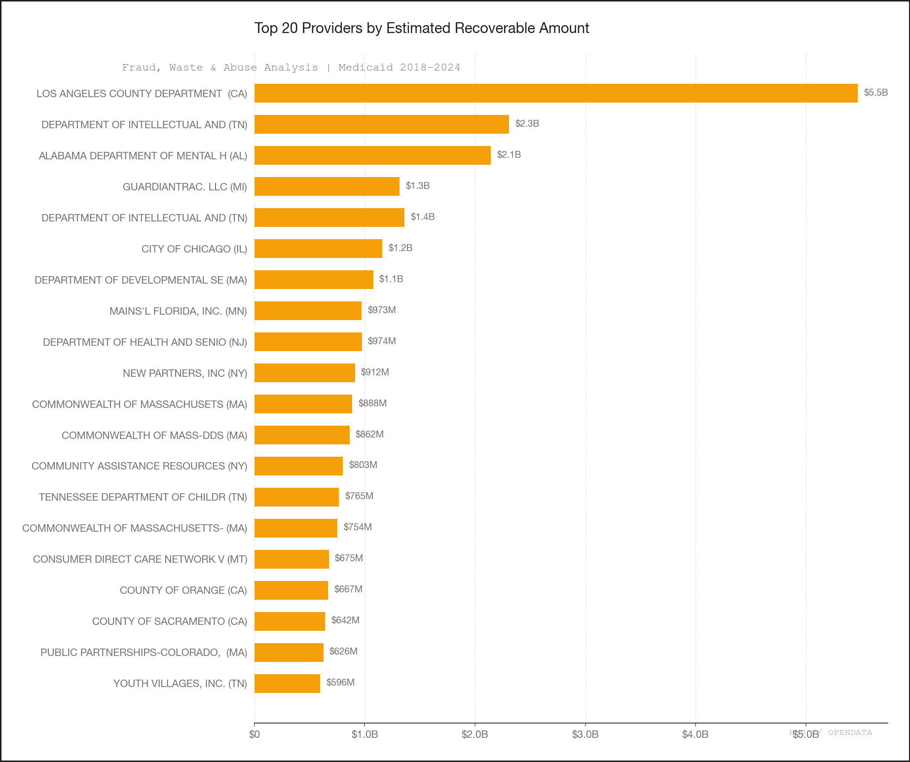

## 2. Methodology

### Dataset

The analysis used the HHS Provider Spending dataset released by the U.S. Department of Health and Human Services. This dataset contains every fee-for-service claim, managed care encounter, and CHIP claim processed by state Medicaid agencies from January 2018 through December 2024. Each record contains the billing provider NPI, servicing provider NPI, HCPCS procedure code, claim month, number of unique beneficiaries, number of claims, and total amount paid.

### Reference Data

Provider identities (names, specialties, locations) were obtained from the NPPES National Provider registry. HCPCS procedure code descriptions were sourced from CMS reference files.

### Analytical Methods

1,087 structured hypotheses were generated and tested across 10 categories:

| Category | Hypotheses | Description |
|----------|-----------|-------------|
| 1. Statistical Outliers | 150 | Z-score, IQR, extreme value, and Benford's Law tests |
| 2. Temporal Anomalies | 120 | Month-over-month spikes, sudden appearance/disappearance, seasonality |
| 3. Peer Comparison | 130 | Rate, volume, and concentration compared to code/state/specialty peers |
| 4. Network Analysis | 120 | Hub-spoke, circular billing, ghost networks, pure billing entities |
| 5. Concentration | 80 | Market dominance, single-code specialists, geographic monopolies |
| 6. Machine Learning | 150 | Isolation Forest, DBSCAN, XGBoost, K-Means, LOF, Random Forest |
| 7. Deep Learning | 80 | Autoencoder, VAE, LSTM, Transformer attention anomalies |
| 8. Domain Rules | 100 | Impossible volumes, upcoding, unbundling, phantom billing |
| 9. Cross-Reference | 70 | Specialty mismatch, entity type, geographic impossibility |
| 10. Composite | Variable | Multi-signal providers flagged by 3+ categories |

**Note:** This includes 87 gap-analysis hypotheses beyond the base 1,000 taxonomy.

### Confidence Tiers

- **High:** Flagged by 3 or more analytical categories, or exhibits a known fraud pattern (impossible service volumes, circular billing), or has a z-score above 5.
- **Medium:** Flagged by 2 categories, or has a z-score between 3 and 5.
- **Low:** Flagged by 1 category with a z-score between 2 and 3.

## 3. High-Confidence Findings

### Finding 1: LOS ANGELES COUNTY DEPARTMENT OF MENTAL HEALTH

- **NPI:** 1699703827
- **Location:** LOS ANGELES, CA
- **Specialty:** Psychiatric Hospital
- **Entity Type:** Organization
- **Active Period:** 2018-01 through 2024-11
- **Total Medicaid Paid:** $6.8B
- **Total Claims:** 30,870,976
- **Total Beneficiaries:** 10,549,232

**Anomaly Description:** Flagged by 7 categories: concentration, crossref, domain, ml, network, peer, statistical, 18 methods, 172 findings

**Detection Methods:** Flagged by 21 of 10 analytical categories: duplicate_billing, impossible_em_visits_day, provider_share_per_code, random_forest, composite_network_plus_volume, billing_fan_out, dbscan, specialty_peer_comparison, no_days_off, lof, zscore_paid_per_claim, state_peer_comparison, composite_multi_signal, iqr_outlier, new_network_high_paid, ensemble_agreement, isolation_forest, volume_vs_median, gev_extreme_value, low_entropy_billing, paid_per_claim_vs_median

**Estimated Recoverable Amount:** $5.5B

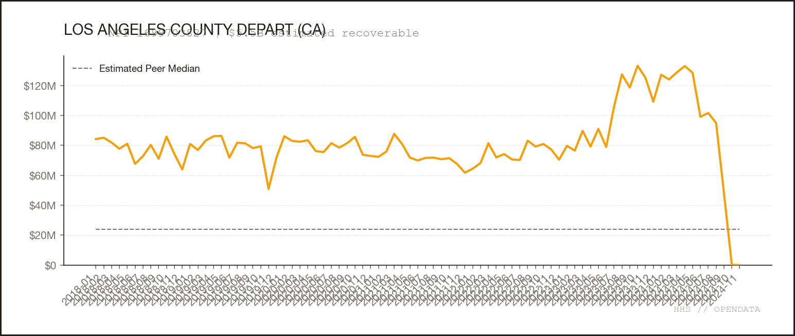

---

### Finding 2: DEPARTMENT OF INTELLECTUAL AND DEVELOPMENTAL DISABILITIES, STATE OF TN

- **NPI:** 1629436241
- **Location:** NASHVILLE, TN
- **Specialty:** Nursing Home
- **Entity Type:** Organization
- **Active Period:** 2018-01 through 2024-06
- **Total Medicaid Paid:** $2.6B
- **Total Claims:** 16,349,155
- **Total Beneficiaries:** 1,174,610

**Anomaly Description:** Flagged by 6 categories: crossref, domain, ml, network, peer, statistical, 13 methods, 66 findings

**Detection Methods:** Flagged by 15 of 10 analytical categories: specialty_peer_comparison, isolation_forest, ensemble_agreement, billing_only_provider, volume_vs_median, composite_multi_signal, claims_per_bene_vs_median, iqr_outlier, new_network_high_paid, gev_extreme_value, dbscan, low_entropy_billing, paid_per_claim_vs_median, lof, high_risk_category

**Estimated Recoverable Amount:** $2.3B

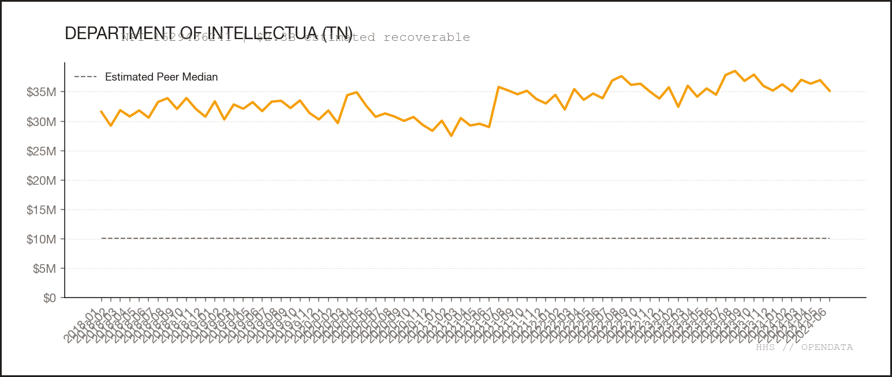

---

### Finding 3: ALABAMA DEPARTMENT OF MENTAL HEALTH AND MENTAL RETARDATION

- **NPI:** 1982757688
- **Location:** MONTGOMERY, AL
- **Specialty:** Community/Behavioral Health
- **Entity Type:** Organization
- **Active Period:** 2018-01 through 2024-12
- **Total Medicaid Paid:** $2.3B
- **Total Claims:** 1,950,098
- **Total Beneficiaries:** 594,985

**Anomaly Description:** Flagged by 5 categories: crossref, ml, network, peer, statistical, 10 methods, 39 findings

**Detection Methods:** Flagged by 13 of 10 analytical categories: specialty_peer_comparison, volume_vs_median, state_peer_comparison, composite_multi_signal, iqr_outlier, new_relationship_high_volume, new_network_high_paid, gev_extreme_value, address_cluster_flagged, dbscan, low_entropy_billing, paid_per_claim_vs_median, lof

**Estimated Recoverable Amount:** $2.1B

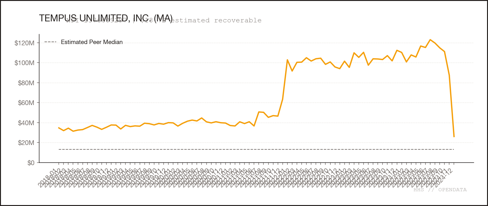

---

### Finding 4: GUARDIANTRAC. LLC

- **NPI:** 1710176151
- **Location:** STURGIS, MI
- **Specialty:** Supports Brokerage
- **Entity Type:** Organization
- **Active Period:** 2018-01 through 2024-12
- **Total Medicaid Paid:** $2.7B
- **Total Claims:** 35,557,539
- **Total Beneficiaries:** 2,441,087

**Anomaly Description:** Flagged by 7 categories: concentration, crossref, domain, ml, peer, statistical, temporal, 12 methods, 100 findings

**Detection Methods:** Flagged by 15 of 10 analytical categories: specialty_peer_comparison, change_point_cusum, no_days_off, volume_vs_median, composite_multi_signal, provider_share_per_code, claims_per_bene_vs_median, iqr_outlier, composite_temporal_plus_statistical, composite_growth_plus_concentration, gev_extreme_value, dbscan, paid_per_claim_vs_median, lof, high_risk_category

**Estimated Recoverable Amount:** $1.3B

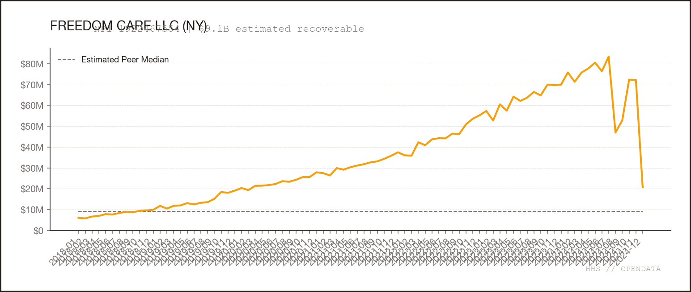

---

### Finding 5: DEPARTMENT OF INTELLECTUAL AND DEVELOPMENTAL DISABILITIES, STATE OF TN

- **NPI:** 1356709976
- **Location:** NASHVILLE, TN
- **Specialty:** Nursing Home
- **Entity Type:** Organization
- **Active Period:** 2018-01 through 2024-06
- **Total Medicaid Paid:** $1.5B
- **Total Claims:** 5,287,026
- **Total Beneficiaries:** 389,567

**Anomaly Description:** Flagged by 6 categories: crossref, domain, ml, network, peer, statistical, 10 methods, 53 findings

**Detection Methods:** Flagged by 11 of 10 analytical categories: specialty_peer_comparison, billing_only_provider, volume_vs_median, composite_multi_signal, claims_per_bene_vs_median, iqr_outlier, gev_extreme_value, dbscan, low_entropy_billing, paid_per_claim_vs_median, high_risk_category

**Estimated Recoverable Amount:** $1.4B

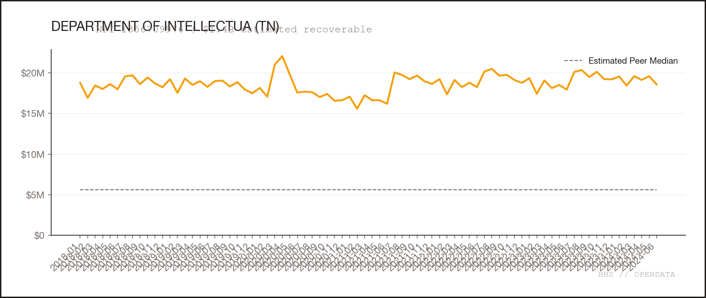

---

### Finding 6: CITY OF CHICAGO

- **NPI:** 1376554592
- **Location:** CHICAGO, IL
- **Specialty:** Emergency Medical Technician
- **Entity Type:** Organization
- **Active Period:** 2018-01 through 2024-12
- **Total Medicaid Paid:** $1.2B
- **Total Claims:** 1,593,649
- **Total Beneficiaries:** 1,193,380

**Anomaly Description:** temporal_plus_statistical: temporal+statistical signals, total categories=5

**Detection Methods:** Flagged by 10 of 10 analytical categories: specialty_peer_comparison, change_point_cusum, kickback_premium, iqr_outlier, composite_temporal_plus_statistical, yoy_growth, gev_extreme_value, dbscan, low_entropy_billing, covid_comparison

**Estimated Recoverable Amount:** $1.2B

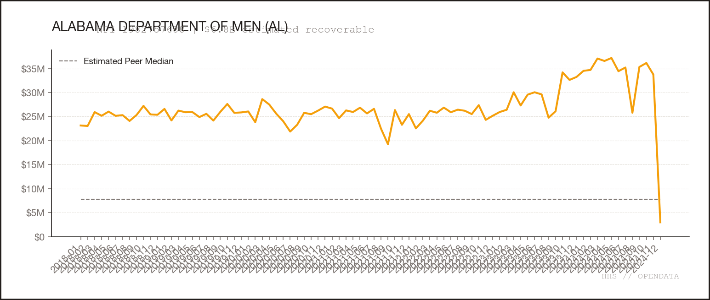

---

### Finding 7: DEPARTMENT OF DEVELOPMENTAL SERVICES

- **NPI:** 1750504064
- **Location:** SOUTHBRIDGE, MA
- **Specialty:** Case Management Agency
- **Entity Type:** Organization
- **Active Period:** 2018-01 through 2024-10
- **Total Medicaid Paid:** $1.3B
- **Total Claims:** 1,662,383
- **Total Beneficiaries:** 224,187

**Anomaly Description:** Transportation: rate_z=-0.3, cpb_ratio=23.4x, total=$32.6M

**Detection Methods:** Flagged by 12 of 10 analytical categories: specialty_peer_comparison, zscore_claims_per_bene, code_concentration_per_provider, volume_vs_median, kickback_premium, claims_per_bene_vs_median, iqr_outlier, gev_extreme_value, dbscan, low_entropy_billing, paid_per_claim_vs_median, high_risk_category

**Estimated Recoverable Amount:** $1.1B

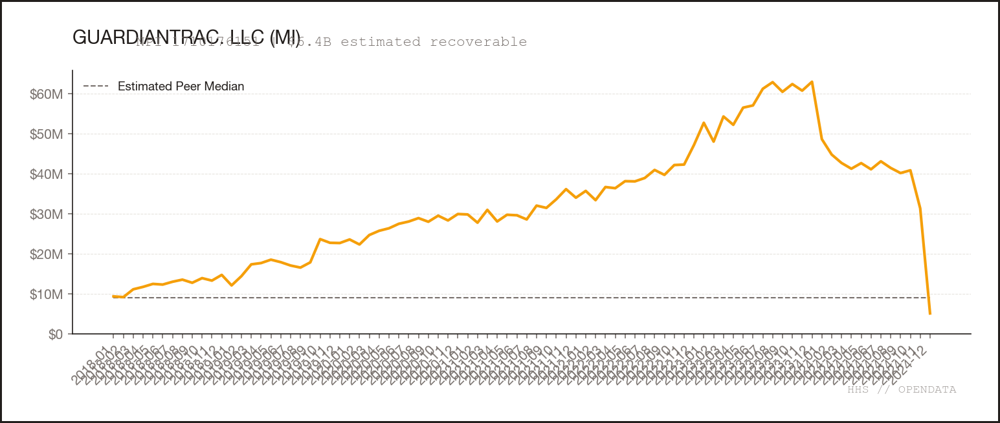

---

### Finding 8: MAINS'L FLORIDA, INC.

- **NPI:** 1932341898
- **Location:** BROOKLYN PARK, MN
- **Specialty:** Home Health Agency
- **Entity Type:** Organization
- **Active Period:** 2018-01 through 2024-12
- **Total Medicaid Paid:** $996.8M
- **Total Claims:** 306,131
- **Total Beneficiaries:** 283,973

**Anomaly Description:** Kickback premium: pair rate=$3,256.13 vs median=$40.06 (81.3x), servicing=1932341898

**Detection Methods:** Flagged by 8 of 10 analytical categories: specialty_peer_comparison, change_point_cusum, code_concentration_per_provider, kickback_premium, provider_share_per_code, iqr_outlier, gev_extreme_value, month_over_month_spike

**Estimated Recoverable Amount:** $973.2M

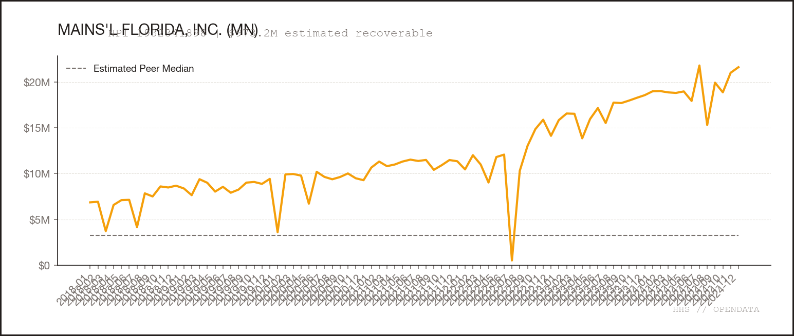

---

### Finding 9: DEPARTMENT OF HEALTH AND SENIOR SERVICES

- **NPI:** 1326168840
- **Location:** TRENTON, NJ
- **Specialty:** Specialist
- **Entity Type:** Organization
- **Active Period:** 2018-01 through 2024-12
- **Total Medicaid Paid:** $1.1B
- **Total Claims:** 3,312,341
- **Total Beneficiaries:** 621,736

**Anomaly Description:** DBSCAN noise/small_cluster: cluster=-1, total_paid=$1.1B

**Detection Methods:** Flagged by 7 of 10 analytical categories: specialty_peer_comparison, kickback_premium, provider_share_per_code, iqr_outlier, gev_extreme_value, dbscan, low_entropy_billing

**Estimated Recoverable Amount:** $973.8M

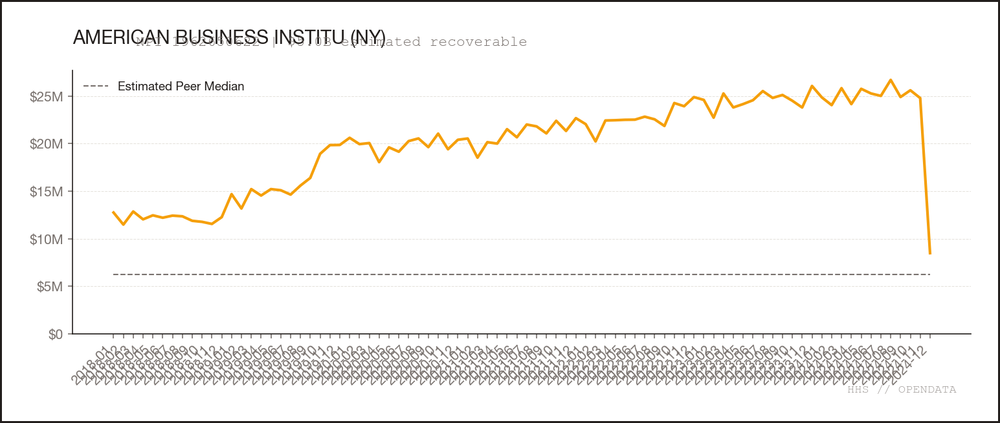

---

### Finding 10: NEW PARTNERS, INC

- **NPI:** 1083783013
- **Location:** NEW YORK, NY
- **Specialty:** Hospice
- **Entity Type:** Organization
- **Active Period:** 2018-01 through 2024-12
- **Total Medicaid Paid:** $1.1B
- **Total Claims:** 5,875,713
- **Total Beneficiaries:** 264,344

**Anomaly Description:** Flagged by 6 categories: crossref, domain, ml, peer, statistical, temporal, 9 methods, 47 findings

**Detection Methods:** Flagged by 12 of 10 analytical categories: specialty_peer_comparison, no_days_off, volume_vs_median, kickback_premium, composite_multi_signal, iqr_outlier, composite_temporal_plus_statistical, yoy_growth, gev_extreme_value, dbscan, low_entropy_billing, high_risk_category

**Estimated Recoverable Amount:** $911.6M

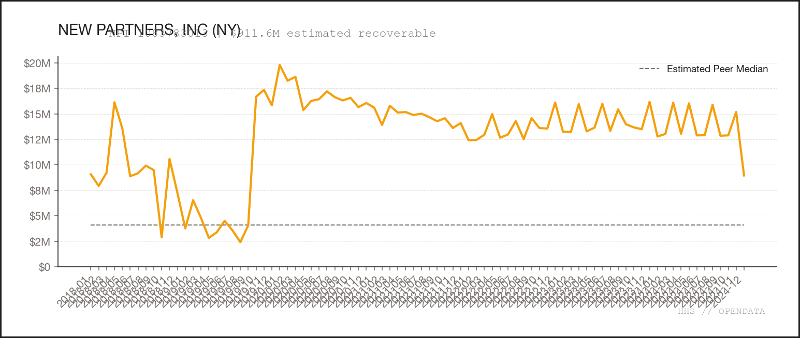

---

### Finding 11: COMMONWEALTH OF MASSACHUSETS

- **NPI:** 1518096411
- **Location:** BEVERLY, MA
- **Specialty:** Case Management Agency
- **Entity Type:** Organization
- **Active Period:** 2018-01 through 2024-10
- **Total Medicaid Paid:** $1.1B
- **Total Claims:** 1,557,105
- **Total Beneficiaries:** 197,206

**Anomaly Description:** Transportation: rate_z=-0.3, cpb_ratio=23.6x, total=$31.4M

**Detection Methods:** Flagged by 13 of 10 analytical categories: specialty_peer_comparison, zscore_claims_per_bene, code_concentration_per_provider, volume_vs_median, state_peer_comparison, kickback_premium, claims_per_bene_vs_median, iqr_outlier, gev_extreme_value, dbscan, low_entropy_billing, paid_per_claim_vs_median, high_risk_category

**Estimated Recoverable Amount:** $887.9M

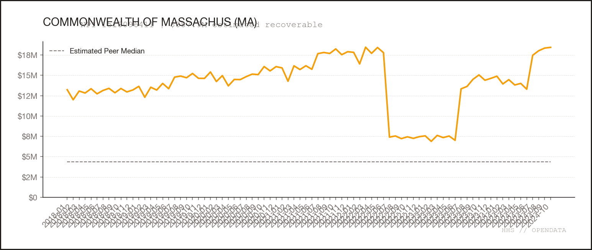

---

### Finding 12: COMMONWEALTH OF MASS-DDS

- **NPI:** 1134250475
- **Location:** HYDE PARK, MA
- **Specialty:** Case Management Agency
- **Entity Type:** Organization
- **Active Period:** 2018-01 through 2024-10
- **Total Medicaid Paid:** $1.1B
- **Total Claims:** 1,432,892
- **Total Beneficiaries:** 259,050

**Anomaly Description:** Transportation: rate_z=-0.3, cpb_ratio=24.9x, total=$22.6M

**Detection Methods:** Flagged by 12 of 10 analytical categories: specialty_peer_comparison, zscore_claims_per_bene, volume_vs_median, state_peer_comparison, kickback_premium, claims_per_bene_vs_median, iqr_outlier, gev_extreme_value, dbscan, low_entropy_billing, paid_per_claim_vs_median, high_risk_category

**Estimated Recoverable Amount:** $862.4M

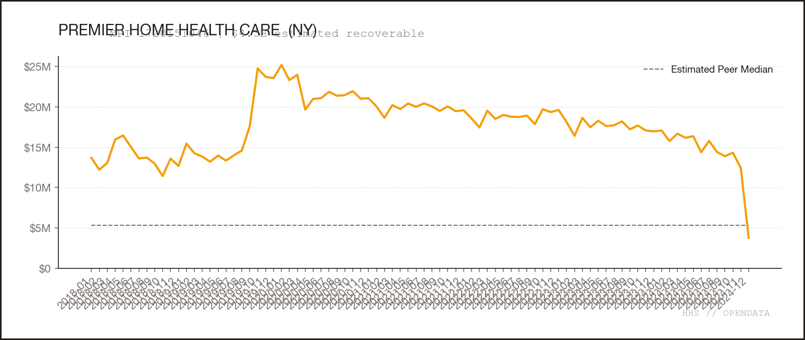

---

### Finding 13: COMMUNITY ASSISTANCE RESOURCES & EXTENDED SERVICES INC

- **NPI:** 1396049987
- **Location:** NEW YORK, NY
- **Specialty:** Day Training/Habilitation
- **Entity Type:** Organization
- **Active Period:** 2019-10 through 2024-12
- **Total Medicaid Paid:** $1.0B
- **Total Claims:** 2,757,160
- **Total Beneficiaries:** 240,183

**Anomaly Description:** Matched bene count (240183): 1396049987 ($1.0B) and 1750705364 ($12.4M)

**Detection Methods:** Flagged by 13 of 10 analytical categories: specialty_peer_comparison, change_point_cusum, zscore_claims_per_bene, volume_vs_median, kickback_premium, shared_bene_count, random_forest, iqr_outlier, yoy_growth, gev_extreme_value, paid_per_claim_vs_median, lof, covid_comparison

**Estimated Recoverable Amount:** $803.0M

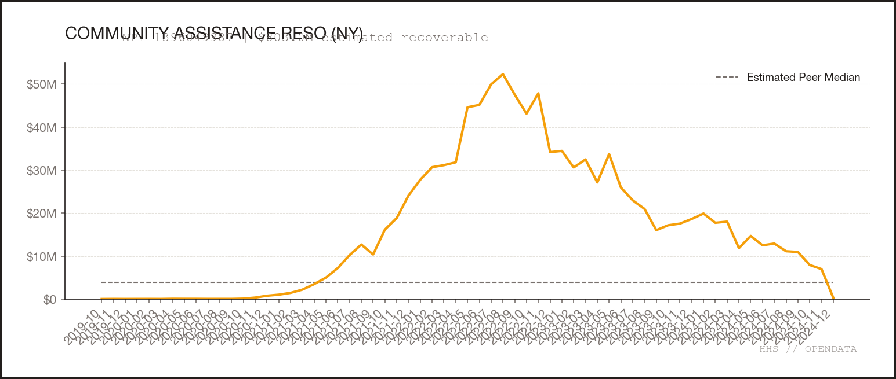

---

### Finding 14: TENNESSEE DEPARTMENT OF CHILDREN'S SERVICES

- **NPI:** 1124494059
- **Location:** NASHVILLE, TN
- **Specialty:** Nursing Home
- **Entity Type:** Organization
- **Active Period:** 2019-07 through 2024-11
- **Total Medicaid Paid:** $781.0M
- **Total Claims:** 910,831
- **Total Beneficiaries:** 877,965

**Anomaly Description:** 

**Detection Methods:** Flagged by 7 of 10 analytical categories: specialty_peer_comparison, code_concentration_per_provider, iqr_outlier, yoy_growth, gev_extreme_value, month_over_month_spike, covid_comparison

**Estimated Recoverable Amount:** $765.1M

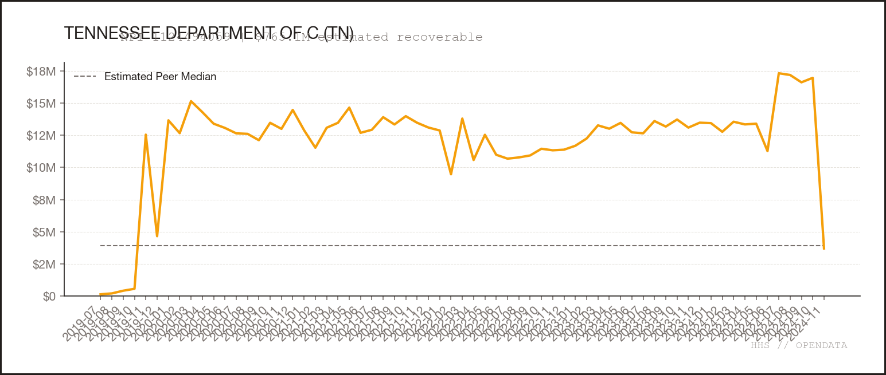

---

### Finding 15: COMMONWEALTH OF MASSACHUSETTS-DDS

- **NPI:** 1245354000
- **Location:** HYANNIS, MA
- **Specialty:** Case Management Agency
- **Entity Type:** Organization
- **Active Period:** 2018-01 through 2024-10
- **Total Medicaid Paid:** $881.9M
- **Total Claims:** 781,227
- **Total Beneficiaries:** 138,263

**Anomaly Description:** Transportation: rate_z=-0.3, cpb_ratio=20.4x, total=$13.2M

**Detection Methods:** Flagged by 9 of 10 analytical categories: specialty_peer_comparison, volume_vs_median, code_concentration_per_provider, state_peer_comparison, claims_per_bene_vs_median, iqr_outlier, gev_extreme_value, paid_per_claim_vs_median, high_risk_category

**Estimated Recoverable Amount:** $753.7M

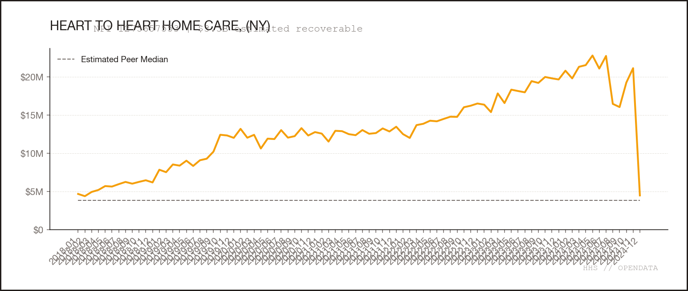

---

### Finding 16: CONSUMER DIRECT CARE NETWORK VIRGINIA

- **NPI:** 1538649983
- **Location:** MISSOULA, MT
- **Specialty:** Case Manager/Care Coordinator
- **Entity Type:** Organization
- **Active Period:** 2018-07 through 2024-12
- **Total Medicaid Paid:** $2.1B
- **Total Claims:** 22,162,533
- **Total Beneficiaries:** 1,069,174

**Anomaly Description:** Flagged by 5 categories: concentration, ml, peer, statistical, temporal, 9 methods, 98 findings

**Detection Methods:** Flagged by 14 of 10 analytical categories: specialty_peer_comparison, change_point_cusum, kickback_premium, composite_multi_signal, provider_share_per_code, iqr_outlier, composite_temporal_plus_statistical, composite_growth_plus_concentration, yoy_growth, gev_extreme_value, address_cluster_flagged, dbscan, month_over_month_spike, lof

**Estimated Recoverable Amount:** $674.8M

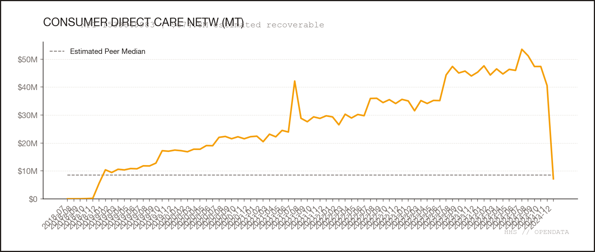

---

### Finding 17: COUNTY OF ORANGE

- **NPI:** 1104963347
- **Location:** SANTA ANA, CA
- **Specialty:** Other
- **Entity Type:** Organization
- **Active Period:** 2018-01 through 2024-12
- **Total Medicaid Paid:** $806.7M
- **Total Claims:** 4,933,775
- **Total Beneficiaries:** 1,554,907

**Anomaly Description:** ed_visit: 99285 ratio=100.0% vs peer median=16.7%, 101 high-level claims of 101 total

**Detection Methods:** Flagged by 7 of 10 analytical categories: zscore_paid_per_claim, volume_vs_median, state_peer_comparison, upcoding, iqr_outlier, gev_extreme_value, paid_per_claim_vs_median

**Estimated Recoverable Amount:** $667.2M

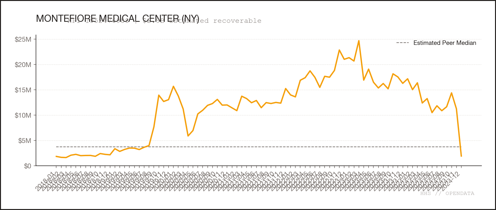

---

### Finding 18: COUNTY OF SACRAMENTO

- **NPI:** 1043386659
- **Location:** SACRAMENTO, CA
- **Specialty:** Case Manager/Care Coordinator
- **Entity Type:** Organization
- **Active Period:** 2018-01 through 2024-11
- **Total Medicaid Paid:** $903.1M
- **Total Claims:** 4,320,082
- **Total Beneficiaries:** 1,851,576

**Anomaly Description:** 

**Detection Methods:** Flagged by 8 of 10 analytical categories: specialty_peer_comparison, change_point_cusum, zscore_paid_per_claim, volume_vs_median, state_peer_comparison, iqr_outlier, gev_extreme_value, paid_per_claim_vs_median

**Estimated Recoverable Amount:** $641.9M

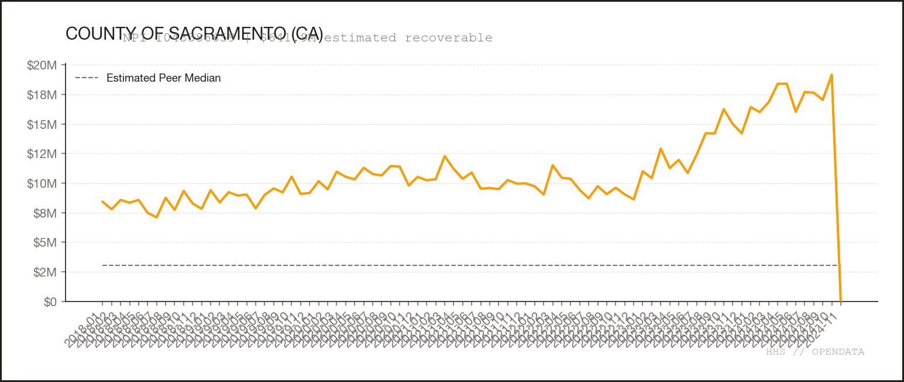

---

### Finding 19: PUBLIC PARTNERSHIPS-COLORADO, INC.

- **NPI:** 1124304621
- **Location:** BOSTON, MA
- **Specialty:** Supports Brokerage
- **Entity Type:** Organization
- **Active Period:** 2018-01 through 2024-12
- **Total Medicaid Paid:** $887.5M
- **Total Claims:** 5,599,208
- **Total Beneficiaries:** 465,275

**Anomaly Description:** Home Health: rate_z=-0.3, cpb_ratio=3.0x, total=$887.5M

**Detection Methods:** Flagged by 7 of 10 analytical categories: specialty_peer_comparison, code_concentration_per_provider, volume_vs_median, claims_per_bene_vs_median, iqr_outlier, gev_extreme_value, high_risk_category

**Estimated Recoverable Amount:** $625.6M

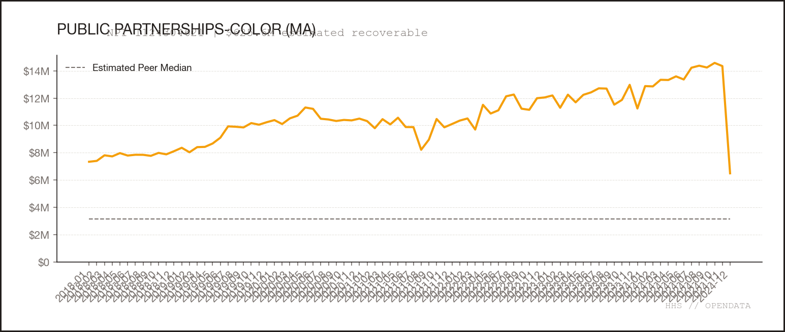

---

### Finding 20: YOUTH VILLAGES, INC.

- **NPI:** 1306875695
- **Location:** BARTLETT, TN
- **Specialty:** Psychiatric Residential
- **Entity Type:** Organization
- **Active Period:** 2018-01 through 2024-11
- **Total Medicaid Paid:** $615.3M
- **Total Claims:** 790,946
- **Total Beneficiaries:** 215,938

**Anomaly Description:** 

**Detection Methods:** Flagged by 7 of 10 analytical categories: specialty_peer_comparison, change_point_cusum, iqr_outlier, yoy_growth, gev_extreme_value, paid_per_claim_vs_median, covid_comparison

**Estimated Recoverable Amount:** $595.8M

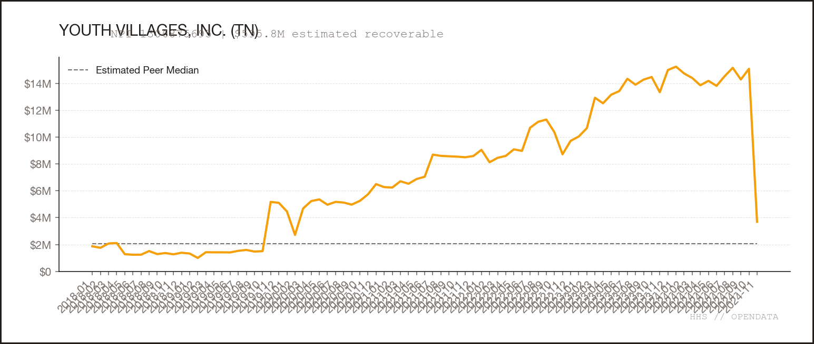

---

### Finding 21: ACUMEN FISCAL AGENT LLC

- **NPI:** 1720145378
- **Location:** MESA, AZ
- **Specialty:** Case Manager/Care Coordinator
- **Entity Type:** Organization
- **Active Period:** 2018-01 through 2024-12
- **Total Medicaid Paid:** $1.1B
- **Total Claims:** 10,544,174
- **Total Beneficiaries:** 655,257

**Anomaly Description:** 

**Detection Methods:** Flagged by 7 of 10 analytical categories: specialty_peer_comparison, change_point_cusum, volume_vs_median, state_peer_comparison, claims_per_bene_vs_median, iqr_outlier, gev_extreme_value

**Estimated Recoverable Amount:** $567.2M

---

### Finding 22: AOC TX, LLC

- **NPI:** 1952346876
- **Location:** SHERMAN, TX
- **Specialty:** Case Management Agency
- **Entity Type:** Organization
- **Active Period:** 2019-07 through 2024-12
- **Total Medicaid Paid:** $708.5M
- **Total Claims:** 1,626,136
- **Total Beneficiaries:** 116,046

**Anomaly Description:** 

**Detection Methods:** Flagged by 10 of 10 analytical categories: specialty_peer_comparison, change_point_cusum, volume_vs_median, state_peer_comparison, iqr_outlier, yoy_growth, gev_extreme_value, month_over_month_spike, paid_per_claim_vs_median, covid_comparison

**Estimated Recoverable Amount:** $546.0M

---

### Finding 23: NV ST DV MH DS DESERT DEV CENTER

- **NPI:** 1780045542
- **Location:** LAS VEGAS, NV
- **Specialty:** Respite In-Home
- **Entity Type:** Organization
- **Active Period:** 2018-01 through 2024-12
- **Total Medicaid Paid:** $545.4M
- **Total Claims:** 702,749
- **Total Beneficiaries:** 233,607

**Anomaly Description:** Address cluster: 6 NPIs at 1391 S JONES BLVD, LAS VEGAS, NV, combined=$703.1M

**Detection Methods:** Flagged by 8 of 10 analytical categories: specialty_peer_comparison, billing_only_provider, volume_vs_median, claims_per_bene_vs_median, iqr_outlier, gev_extreme_value, address_cluster_flagged, paid_per_claim_vs_median

**Estimated Recoverable Amount:** $512.6M

---

### Finding 24: CENTRIA HEALTHCARE LLC

- **NPI:** 1053641498
- **Location:** FARMINGTON HILLS, MI
- **Specialty:** Other
- **Entity Type:** Organization
- **Active Period:** 2018-01 through 2024-12
- **Total Medicaid Paid:** $590.6M
- **Total Claims:** 2,755,271
- **Total Beneficiaries:** 357,738

**Anomaly Description:** ABA cpb=7.4 vs state median=1.3 (5.8x), total=$438.2M

**Detection Methods:** Flagged by 5 of 10 analytical categories: aba_peer_cpb, iqr_outlier, new_network_high_paid, gev_extreme_value, paid_per_claim_vs_median

**Estimated Recoverable Amount:** $500.4M

---

### Finding 25: BANCROFT, A NEW JERSEY NONPROFIT CORPORATION

- **NPI:** 1720121106
- **Location:** CHERRY HILL, NJ
- **Specialty:** Other
- **Entity Type:** Organization
- **Active Period:** 2018-01 through 2024-12
- **Total Medicaid Paid:** $560.4M
- **Total Claims:** 1,802,919
- **Total Beneficiaries:** 115,599

**Anomaly Description:** Behavioral Health: rate_z=0.0, cpb_ratio=4.1x, total=$417.9M

**Detection Methods:** Flagged by 8 of 10 analytical categories: change_point_cusum, volume_vs_median, state_peer_comparison, claims_per_bene_vs_median, iqr_outlier, gev_extreme_value, paid_per_claim_vs_median, high_risk_category

**Estimated Recoverable Amount:** $515.0M

---

### Finding 26: CITY & COUNTY OF SAN FRANCISCO

- **NPI:** 1417099789
- **Location:** SAN FRANCISCO, CA
- **Specialty:** Supports Brokerage
- **Entity Type:** Organization
- **Active Period:** 2018-01 through 2024-12
- **Total Medicaid Paid:** $1.3B
- **Total Claims:** 6,184,815
- **Total Beneficiaries:** 1,302,440

**Anomaly Description:** New relationship: $4.8M first month (2018-01), servicing=1508933862

**Detection Methods:** Flagged by 10 of 10 analytical categories: specialty_peer_comparison, zscore_paid_per_claim, zscore_claims_per_bene, volume_vs_median, state_peer_comparison, iqr_outlier, new_relationship_high_volume, gev_extreme_value, dbscan, paid_per_claim_vs_median

**Estimated Recoverable Amount:** $502.4M

---

### Finding 27: ZOLL SERVICES LLC

- **NPI:** 1164535274
- **Location:** PITTSBURGH, PA
- **Specialty:** DME Supplier
- **Entity Type:** Organization
- **Active Period:** 2018-01 through 2024-12
- **Total Medicaid Paid:** $504.0M
- **Total Claims:** 477,988
- **Total Beneficiaries:** 391,060

**Anomaly Description:** K-means cluster 6: distance=25.94, mean_cluster_distance=5.34, ratio=4.9x

**Detection Methods:** Flagged by 7 of 10 analytical categories: specialty_peer_comparison, code_concentration_per_provider, kmeans, provider_share_per_code, iqr_outlier, gev_extreme_value, hhi_per_code

**Estimated Recoverable Amount:** $486.3M

---

### Finding 28: MA-DEPARTMENT OF SOCIAL SERVICES-REHAB

- **NPI:** 1073730347
- **Location:** BOSTON, MA
- **Specialty:** Nursing Home
- **Entity Type:** Organization
- **Active Period:** 2018-01 through 2024-08
- **Total Medicaid Paid:** $490.7M
- **Total Claims:** 225,775
- **Total Beneficiaries:** 106,190

**Anomaly Description:** Matched bene count (106190): 1073730347 ($490.7M) and 1326007915 ($5.8M)

**Detection Methods:** Flagged by 5 of 10 analytical categories: specialty_peer_comparison, code_concentration_per_provider, shared_bene_count, iqr_outlier, gev_extreme_value

**Estimated Recoverable Amount:** $487.1M

---

### Finding 29: NATERA, INC.

- **NPI:** 1558672279
- **Location:** SAN CARLOS, CA
- **Specialty:** Clinical Lab
- **Entity Type:** Organization
- **Active Period:** 2018-01 through 2024-12
- **Total Medicaid Paid:** $641.5M
- **Total Claims:** 7,257,656
- **Total Beneficiaries:** 6,431,366

**Anomaly Description:** 

**Detection Methods:** Flagged by 7 of 10 analytical categories: specialty_peer_comparison, change_point_cusum, provider_share_per_code, iqr_outlier, gev_extreme_value, reciprocal_billing, hhi_per_code

**Estimated Recoverable Amount:** $477.0M

---

### Finding 30: SHIELD CALIFORNIA HEALTH CARE CENTER INC

- **NPI:** 1881708899
- **Location:** VALENCIA, CA
- **Specialty:** Pharmacy
- **Entity Type:** Organization
- **Active Period:** 2018-01 through 2024-12
- **Total Medicaid Paid:** $522.6M
- **Total Claims:** 10,338,535
- **Total Beneficiaries:** 10,087,772

**Anomaly Description:** 

**Detection Methods:** Flagged by 4 of 10 analytical categories: iqr_outlier, specialty_peer_comparison, reciprocal_billing, gev_extreme_value

**Estimated Recoverable Amount:** $473.1M

---

### Finding 31: NATIONWIDE CHILDREN'S HOSPITAL

- **NPI:** 1134152986
- **Location:** COLUMBUS, OH
- **Specialty:** Dental Clinic
- **Entity Type:** Organization
- **Active Period:** 2018-01 through 2024-12
- **Total Medicaid Paid:** $777.5M
- **Total Claims:** 11,019,261
- **Total Beneficiaries:** 8,541,239

**Anomaly Description:** IsolationForest high_volume: anomaly_score=0.750, top_features=[num_servicing_npis, max_single_month_paid, total_paid]

**Detection Methods:** Flagged by 10 of 10 analytical categories: specialty_peer_comparison, change_point_cusum, isolation_forest, volume_vs_median, state_peer_comparison, iqr_outlier, gev_extreme_value, address_cluster_flagged, billing_fan_out, paid_per_claim_vs_median

**Estimated Recoverable Amount:** $447.0M

---

### Finding 32: DAP HEALTH, INC.

- **NPI:** 1275849283
- **Location:** DESERT HOT SPRINGS, CA
- **Specialty:** Family Medicine
- **Entity Type:** Organization
- **Active Period:** 2018-01 through 2024-12
- **Total Medicaid Paid:** $463.0M
- **Total Claims:** 1,868,258
- **Total Beneficiaries:** 905,720

**Anomaly Description:** 

**Detection Methods:** Flagged by 6 of 10 analytical categories: change_point_cusum, specialty_peer_comparison, volume_vs_median, iqr_outlier, gev_extreme_value, reciprocal_billing

**Estimated Recoverable Amount:** $445.4M

---

### Finding 33: RECTOR & VISITORS OF THE UNIVERSITY OF VIRGINIA

- **NPI:** 1780630608
- **Location:** CHARLOTTESVILLE, VA
- **Specialty:** Clinical Lab
- **Entity Type:** Organization
- **Active Period:** 2018-01 through 2024-12
- **Total Medicaid Paid:** $500.5M
- **Total Claims:** 7,181,828
- **Total Beneficiaries:** 5,089,874

**Anomaly Description:** 

**Detection Methods:** Flagged by 9 of 10 analytical categories: specialty_peer_comparison, change_point_cusum, zscore_paid_per_claim, volume_vs_median, state_peer_comparison, iqr_outlier, gev_extreme_value, paid_per_claim_vs_median, hhi_per_code

**Estimated Recoverable Amount:** $439.7M

---

### Finding 34: ARION CARE SOLUTIONS, LLC

- **NPI:** 1932721834
- **Location:** CHANDLER, AZ
- **Specialty:** Other
- **Entity Type:** Organization
- **Active Period:** 2019-07 through 2024-12
- **Total Medicaid Paid:** $606.7M
- **Total Claims:** 5,766,334
- **Total Beneficiaries:** 393,994

**Anomaly Description:** 

**Detection Methods:** Flagged by 4 of 10 analytical categories: iqr_outlier, yoy_growth, gev_extreme_value, change_point_cusum

**Estimated Recoverable Amount:** $440.7M

---

### Finding 35: PHOENIX CHILDREN'S HOSPITAL

- **NPI:** 1760480503
- **Location:** PHOENIX, AZ
- **Specialty:** Other
- **Entity Type:** Organization
- **Active Period:** 2018-01 through 2024-12
- **Total Medicaid Paid:** $555.7M
- **Total Claims:** 4,185,462
- **Total Beneficiaries:** 3,641,942

**Anomaly Description:** Address cluster: 54 NPIs at 1919 E THOMAS RD, PHOENIX, AZ, combined=$721.3M

**Detection Methods:** Flagged by 5 of 10 analytical categories: volume_vs_median, iqr_outlier, address_cluster_flagged, gev_extreme_value, hhi_per_code

**Estimated Recoverable Amount:** $435.3M

---

### Finding 36: UNIVERSITY OF KENTUCKY

- **NPI:** 1518911338
- **Location:** LEXINGTON, KY
- **Specialty:** Ambulance
- **Entity Type:** Organization
- **Active Period:** 2018-01 through 2024-12
- **Total Medicaid Paid:** $716.4M
- **Total Claims:** 8,817,197
- **Total Beneficiaries:** 6,877,120

**Anomaly Description:** Address cluster: 19 NPIs at 800 ROSE ST, LEXINGTON, KY, combined=$720.2M

**Detection Methods:** Flagged by 7 of 10 analytical categories: specialty_peer_comparison, volume_vs_median, state_peer_comparison, pharmacy_rate_outlier, iqr_outlier, gev_extreme_value, address_cluster_flagged

**Estimated Recoverable Amount:** $427.3M

---

### Finding 37: CONSUMER DIRECTED SERVICES IN TEXAS, INC.

- **NPI:** 1801027404
- **Location:** SAN ANTONIO, TX
- **Specialty:** Home Health Agency
- **Entity Type:** Organization
- **Active Period:** 2018-01 through 2024-12
- **Total Medicaid Paid:** $624.8M
- **Total Claims:** 3,406,847
- **Total Beneficiaries:** 599,363

**Anomaly Description:** 

**Detection Methods:** Flagged by 9 of 10 analytical categories: specialty_peer_comparison, change_point_cusum, volume_vs_median, state_peer_comparison, provider_share_per_code, iqr_outlier, yoy_growth, gev_extreme_value, hhi_per_code

**Estimated Recoverable Amount:** $415.5M

---

### Finding 38: SCOTTISH RITE CHILDREN'S MEDICAL CENTER

- **NPI:** 1184779332
- **Location:** ATLANTA, GA
- **Specialty:** Other
- **Entity Type:** Organization
- **Active Period:** 2018-01 through 2024-12
- **Total Medicaid Paid:** $493.4M
- **Total Claims:** 3,556,445
- **Total Beneficiaries:** 3,026,103

**Anomaly Description:** Captive referral: 96.6% of $493.2M through servicing NPI 1922178789

**Detection Methods:** Flagged by 9 of 10 analytical categories: volume_vs_median, state_peer_comparison, upcoding, iqr_outlier, new_relationship_high_volume, captive_referral, gev_extreme_value, paid_per_claim_vs_median, hhi_per_code

**Estimated Recoverable Amount:** $387.9M

---

### Finding 39: COUNTY OF SANTA CLARA

- **NPI:** 1528263910
- **Location:** SAN JOSE, CA
- **Specialty:** Mental Health Center
- **Entity Type:** Organization
- **Active Period:** 2018-01 through 2024-10
- **Total Medicaid Paid:** $1.7B
- **Total Claims:** 4,656,205
- **Total Beneficiaries:** 1,617,142

**Anomaly Description:** Flagged by 6 categories: crossref, ml, network, peer, statistical, temporal, 13 methods, 78 findings

**Detection Methods:** Flagged by 16 of 10 analytical categories: specialty_peer_comparison, change_point_cusum, zscore_paid_per_claim, zscore_claims_per_bene, volume_vs_median, state_peer_comparison, no_days_off, composite_multi_signal, iqr_outlier, new_relationship_high_volume, composite_temporal_plus_statistical, new_network_high_paid, gev_extreme_value, dbscan, low_entropy_billing, paid_per_claim_vs_median

**Estimated Recoverable Amount:** $387.8M

---

### Finding 40: CHILDREN'S HOSPITAL MEDICAL CENTER OF AKRON

- **NPI:** 1861506560
- **Location:** AKRON, OH
- **Specialty:** Other
- **Entity Type:** Organization
- **Active Period:** 2018-01 through 2024-12
- **Total Medicaid Paid:** $556.6M
- **Total Claims:** 6,634,271
- **Total Beneficiaries:** 5,639,593

**Anomaly Description:** IsolationForest home_health_high: anomaly_score=0.770, top_features=[max_single_month_paid, num_codes, num_servicing_npis]

**Detection Methods:** Flagged by 11 of 10 analytical categories: change_point_cusum, isolation_forest, zscore_paid_per_claim, volume_vs_median, state_peer_comparison, iqr_outlier, yoy_growth, gev_extreme_value, address_cluster_flagged, billing_fan_out, paid_per_claim_vs_median

**Estimated Recoverable Amount:** $378.7M

---

### Finding 41: WALL RESIDENCES, LLC

- **NPI:** 1063436723
- **Location:** FLOYD, VA
- **Specialty:** ID/MR Community
- **Entity Type:** Organization
- **Active Period:** 2018-01 through 2024-11
- **Total Medicaid Paid:** $481.6M
- **Total Claims:** 89,469
- **Total Beneficiaries:** 69,770

**Anomaly Description:** Behavioral Health: rate_z=7.4, cpb_ratio=0.2x, total=$184.5M

**Detection Methods:** Flagged by 9 of 10 analytical categories: specialty_peer_comparison, zscore_paid_per_claim, state_peer_comparison, shared_bene_count, random_forest, iqr_outlier, gev_extreme_value, paid_per_claim_vs_median, high_risk_category

**Estimated Recoverable Amount:** $375.7M

---

### Finding 42: TEXAS DEPARTMENT OF STATE HEALTH

- **NPI:** 1114931391
- **Location:** AUSTIN, TX
- **Specialty:** Clinical Lab
- **Entity Type:** Organization
- **Active Period:** 2018-01 through 2024-12
- **Total Medicaid Paid:** $381.9M
- **Total Claims:** 2,710,132
- **Total Beneficiaries:** 2,323,406

**Anomaly Description:** 

**Detection Methods:** Flagged by 11 of 10 analytical categories: specialty_peer_comparison, change_point_cusum, december_spike, code_concentration_per_provider, provider_share_per_code, iqr_outlier, yoy_growth, gev_extreme_value, month_over_month_spike, hhi_per_code, covid_comparison

**Estimated Recoverable Amount:** $369.8M

---

### Finding 43: STATE OF MISSOURI

- **NPI:** 1447886288
- **Location:** JEFFERSON CITY, MO
- **Specialty:** Other
- **Entity Type:** Organization
- **Active Period:** 2018-01 through 2024-12
- **Total Medicaid Paid:** $493.6M
- **Total Claims:** 3,328,210
- **Total Beneficiaries:** 845,819

**Anomaly Description:** Address cluster: 5 NPIs at 1706 E ELM ST, JEFFERSON CITY, MO, combined=$857.0M

**Detection Methods:** Flagged by 7 of 10 analytical categories: change_point_cusum, zscore_paid_per_claim, billing_only_provider, iqr_outlier, gev_extreme_value, address_cluster_flagged, paid_per_claim_vs_median

**Estimated Recoverable Amount:** $363.2M

---

### Finding 44: COMMONWEALTH OF MASSACHUSETTS-DDS

- **NPI:** 1023140498
- **Location:** S WEYMOUTH, MA
- **Specialty:** Case Management Agency
- **Entity Type:** Organization
- **Active Period:** 2018-01 through 2024-10
- **Total Medicaid Paid:** $447.5M
- **Total Claims:** 578,640
- **Total Beneficiaries:** 121,972

**Anomaly Description:** 

**Detection Methods:** Flagged by 7 of 10 analytical categories: specialty_peer_comparison, volume_vs_median, state_peer_comparison, claims_per_bene_vs_median, iqr_outlier, gev_extreme_value, paid_per_claim_vs_median

**Estimated Recoverable Amount:** $352.6M

---

### Finding 45: COMMONWEALTH OF MASSACHUSETTS

- **NPI:** 1942339825
- **Location:** HAVERHILL, MA
- **Specialty:** Case Management Agency
- **Entity Type:** Organization
- **Active Period:** 2018-01 through 2024-10
- **Total Medicaid Paid:** $444.0M
- **Total Claims:** 584,358
- **Total Beneficiaries:** 163,989

**Anomaly Description:** 

**Detection Methods:** Flagged by 5 of 10 analytical categories: specialty_peer_comparison, volume_vs_median, claims_per_bene_vs_median, iqr_outlier, gev_extreme_value

**Estimated Recoverable Amount:** $348.1M

---

### Finding 46: DEPARTMENT OF DEVELOPMENTAL SERVICES

- **NPI:** 1528281532
- **Location:** SPRINGFIELD, MA
- **Specialty:** Case Management Agency
- **Entity Type:** Organization
- **Active Period:** 2018-01 through 2024-10
- **Total Medicaid Paid:** $465.4M
- **Total Claims:** 750,654
- **Total Beneficiaries:** 157,791

**Anomaly Description:** Matched bene count (157791): 1528281532 ($465.4M) and 1609143452 ($3.3M)

**Detection Methods:** Flagged by 9 of 10 analytical categories: specialty_peer_comparison, volume_vs_median, state_peer_comparison, kmeans, shared_bene_count, claims_per_bene_vs_median, iqr_outlier, gev_extreme_value, paid_per_claim_vs_median

**Estimated Recoverable Amount:** $342.2M

---

### Finding 47: COMMUNITY ACCESS UNLIMITED

- **NPI:** 1821456526
- **Location:** ELIZABETH, NJ
- **Specialty:** Supports Brokerage
- **Entity Type:** Organization
- **Active Period:** 2018-01 through 2024-12
- **Total Medicaid Paid:** $355.7M
- **Total Claims:** 855,357
- **Total Beneficiaries:** 93,205

**Anomaly Description:** Behavioral Health: rate_z=0.1, cpb_ratio=4.3x, total=$321.8M

**Detection Methods:** Flagged by 7 of 10 analytical categories: specialty_peer_comparison, change_point_cusum, volume_vs_median, claims_per_bene_vs_median, iqr_outlier, gev_extreme_value, high_risk_category

**Estimated Recoverable Amount:** $330.4M

---

### Finding 48: COMMONWEALTH OF MASS-DDS

- **NPI:** 1982735643
- **Location:** WALPOLE, MA
- **Specialty:** Case Management Agency
- **Entity Type:** Organization
- **Active Period:** 2018-01 through 2024-10
- **Total Medicaid Paid:** $435.8M
- **Total Claims:** 658,415
- **Total Beneficiaries:** 125,032

**Anomaly Description:** 

**Detection Methods:** Flagged by 7 of 10 analytical categories: specialty_peer_comparison, volume_vs_median, state_peer_comparison, claims_per_bene_vs_median, iqr_outlier, gev_extreme_value, paid_per_claim_vs_median

**Estimated Recoverable Amount:** $327.7M

---

### Finding 49: ACADIAN AMBULANCE SERVICE, INC.

- **NPI:** 1316943566
- **Location:** LAFAYETTE, LA
- **Specialty:** Other
- **Entity Type:** Organization
- **Active Period:** 2018-01 through 2024-12
- **Total Medicaid Paid:** $422.7M
- **Total Claims:** 3,712,955
- **Total Beneficiaries:** 2,598,536

**Anomaly Description:** 

**Detection Methods:** Flagged by 3 of 10 analytical categories: iqr_outlier, gev_extreme_value, change_point_cusum

**Estimated Recoverable Amount:** $306.9M

---

### Finding 50: COORDINATED BEHAVIORAL CARE, INC

- **NPI:** 1730451071
- **Location:** NEW YORK, NY
- **Specialty:** Case Management Agency
- **Entity Type:** Organization
- **Active Period:** 2018-07 through 2024-12
- **Total Medicaid Paid:** $407.2M
- **Total Claims:** 1,213,709
- **Total Beneficiaries:** 1,212,752

**Anomaly Description:** 

**Detection Methods:** Flagged by 6 of 10 analytical categories: specialty_peer_comparison, change_point_cusum, iqr_outlier, yoy_growth, gev_extreme_value, covid_comparison

**Estimated Recoverable Amount:** $308.8M

---

## 4. Medium-Confidence Findings

| # | Provider | NPI | State | Estimated Impact | Methods | Primary Method |
|---|----------|-----|-------|-----------------|---------|----------------|
| 15584 | NEW YORK CITY HEALTH AND HOSPI | 1083715460 | NY | $293.6M | 2 | gev_extreme_value |
| 15585 | ROCKY MOUNTAIN HOLDINGS, LLC | 1407855240 | AL | $279.7M | 2 | gev_extreme_value |
| 15586 | NEW MEXICO CONSUMER DIRECT PER | 1740376292 | NM | $125.2M | 2 | iqr_outlier |
| 15587 | CITY OF PHOENIX ARIZONA | 1982781571 | AZ | $116.1M | 2 | gev_extreme_value |
| 15588 | WAYPOINT MAINE, INC. | 1649495110 | ME | $100.8M | 2 | specialty_peer_comparison |
| 15589 | D & D SERVICES INC | 1629080254 | OK | $94.4M | 2 | gev_extreme_value |
| 15590 | RUTGERS HEALTH - UNIVERSITY BE | 1942217054 | NJ | $94.1M | 2 | specialty_peer_comparison |
| 15591 | AMERICAN MEDICAL RESPONSE OF C | 1043243538 | CT | $93.1M | 2 | iqr_outlier |
| 15592 | NATIONAL CHILDREN'S CENTER, IN | 1700099959 | DC | $88.0M | 2 | specialty_peer_comparison |
| 15593 | ST. JOHN'S COMMUNITY SERVICES- | 1780806828 | DC | $85.7M | 2 | gev_extreme_value |
| 15594 | COMMUNITY LIVING SERVICES, INC | 1326657602 | ND | $84.4M | 2 | specialty_peer_comparison |
| 15595 | CAPITAL CARE, INC | 1366527111 | MD | $84.3M | 2 | specialty_peer_comparison |
| 15596 | PEABODY RESIDENT SERVICES INC | 1124236724 | MA | $84.7M | 2 | gev_extreme_value |
| 15597 | 180 MEDICAL INC | 1639160708 | OK | $81.9M | 2 | iqr_outlier |
| 15598 | BREWSTER AMBULANCE SERVICE INC | 1760707582 | MA | $77.6M | 2 | gev_extreme_value |
| 15599 | GOOD NEIGHBOR ASSISTED LIVING  | 1609947845 | AZ | $75.2M | 2 | code_concentration_per_provider |
| 15600 | PORT RESOURCES | 1053467779 | ME | $76.7M | 2 | gev_extreme_value |
| 15601 | GREEN RIVER REGIONAL MENTAL HE | 1629134663 | KY | $73.7M | 2 | specialty_peer_comparison |
| 15602 | COMMUNITY OPTIONS FOR RESIDENT | 1356951503 | ND | $71.8M | 2 | specialty_peer_comparison |
| 15603 | EL MIRADOR INCORPORATED | 1942617600 | NM | $71.1M | 2 | gev_extreme_value |
| 15604 | VITRA HEALTH, INC. | 1073887246 | MA | $71.8M | 2 | gev_extreme_value |
| 15605 | LIFEMED ALASKA, LLC | 1871754473 | AK | $71.4M | 2 | gev_extreme_value |
| 15606 | SUPPORT SERVICES OF VIRGINIA,  | 1487747135 | VA | $69.5M | 2 | specialty_peer_comparison |
| 15607 | CENTRAL STATE COMMUNITY SERVIC | 1245459460 | MI | $65.5M | 2 | gev_extreme_value |
| 15608 | HOMETOWN OXYGEN CHARLOTTE LLC | 1871738153 | NC | $66.9M | 2 | gev_extreme_value |
| 15609 | HELP AT HOME, LLC | 1790813095 | MO | $67.4M | 2 | gev_extreme_value |
| 15610 | FOREVER CARE DBA INDEPENDENT O | 1033275755 | KY | $65.2M | 2 | gev_extreme_value |
| 15611 | SUPPORT SOLUTIONS INC | 1235299496 | ME | $67.6M | 2 | gev_extreme_value |
| 15612 | LANCASTER HOSPITAL CORPORATION | 1508856535 | CA | $65.0M | 2 | iqr_outlier |
| 15613 | SENIORCARE EMERGENCY MEDICAL S | 1265542765 | NY | $64.1M | 2 | gev_extreme_value |
| 15614 | WHOLISTIC SERVICES, INC. | 1083883243 | DC | $63.3M | 2 | specialty_peer_comparison |
| 15615 | WATTS HEALTHCARE CORPORATION | 1477649119 | CA | $63.7M | 2 | gev_extreme_value |
| 15616 | ALTERNATIVE SERVICES-NE, INC. | 1114152089 | ME | $64.8M | 2 | gev_extreme_value |
| 15617 | MASSACHUSETTS REHABILITATION C | 1326250150 | MA | $62.7M | 2 | iqr_outlier |
| 15618 | HEALTHY LIVING MEDICAL SUPPLY, | 1033142948 | MI | $61.0M | 2 | gev_extreme_value |
| 15619 | RESPIRATORY TECHNOLOGIES, INC. | 1962459537 | MN | $61.3M | 2 | gev_extreme_value |
| 15620 | ELM WASECA COUNTY SLS INC | 1770625477 | MN | $61.0M | 2 | specialty_peer_comparison |
| 15621 | CAPITOL COUNTY CHILDREN'S COLL | 1942350020 | NJ | $61.1M | 2 | specialty_peer_comparison |
| 15622 | PRIDE INC. | 1356453484 | ND | $59.3M | 2 | specialty_peer_comparison |
| 15623 | CG OF TENNESSEE, LLC | 1306364054 | TN | $60.4M | 2 | gev_extreme_value |
| 15624 | LIFESKILLS, INC. | 1669401816 | KY | $58.7M | 2 | specialty_peer_comparison |
| 15625 | JHC OPERATIONS, LLC | 1518004233 | TX | $59.9M | 2 | gev_extreme_value |
| 15626 | COMPLETE HEALTH CARE SOLUTIONS | 1134271885 | MO | $58.4M | 2 | gev_extreme_value |
| 15627 | HUMAN SERVICES BOARD SERVING N | 1952423808 | WI | $57.6M | 2 | gev_extreme_value |
| 15628 | BRIDGEWAY BEHAVIORAL HEALTH SE | 1184748535 | NJ | $56.7M | 2 | gev_extreme_value |
| 15629 | OPTUM PHARMACY 702, LLC | 1083045140 | IN | $55.1M | 2 | specialty_peer_comparison |
| 15630 | SAGUARO FOUNDATION | 1992998348 | AZ | $56.1M | 2 | gev_extreme_value |
| 15631 | CITY OF LAS VEGAS | 1336290964 | NV | $55.2M | 2 | gev_extreme_value |
| 15632 | MAYO CLINIC AMBULANCE | 1659397164 | MN | $55.5M | 2 | gev_extreme_value |
| 15633 | ASAP HOME HEALTH, INC | 1003969114 | CA | $56.3M | 2 | gev_extreme_value |
| 15634 | DIABETES MANAGEMENT AND SUPPLI | 1164537452 | LA | $54.9M | 2 | gev_extreme_value |
| 15635 | STC OPCO LLC | 1194368167 | PA | $55.3M | 2 | gev_extreme_value |
| 15636 | FAIRFAX COUNTY, VIRGINIA | 1154356244 | VA | $55.3M | 2 | gev_extreme_value |
| 15637 | PERRYLEE HOME HEALTH CARE SERV | 1568591725 | TX | $55.9M | 2 | gev_extreme_value |
| 15638 | ONE SOURCE MEDICAL GROUP LLC | 1366653545 | FL | $55.4M | 2 | specialty_peer_comparison |
| 15639 | RAMSEY COUNTY COMMUNITY HUMAN  | 1811055957 | MN | $53.7M | 2 | gev_extreme_value |
| 15640 | EASTER SEALS BLAKE FOUNDATION | 1548356207 | AZ | $54.0M | 2 | gev_extreme_value |
| 15641 | NEW MEXICO DEPARTMENT OF HEALT | 1194886499 | NM | $52.0M | 2 | gev_extreme_value |
| 15642 | MAXIM HEALTHCARE SERVICES, INC | 1306800172 | OH | $52.4M | 2 | gev_extreme_value |
| 15643 | ELITE MEDICAL TRANSPORTATION L | 1710294368 | IL | $52.6M | 2 | gev_extreme_value |
| 15644 | HOME DELIVERY INCONTINENT SUPP | 1649383084 | MO | $52.4M | 2 | gev_extreme_value |
| 15645 | MAXIM HEALTHCARE SERVICES, INC | 1104920487 | VA | $50.4M | 2 | specialty_peer_comparison |
| 15646 | FAIRFAX COUNTY, VIRGINIA | 1174558266 | VA | $50.3M | 2 | gev_extreme_value |
| 15647 | MISSION MEDSTAFF, LLC | 1205163185 | NC | $50.4M | 2 | gev_extreme_value |
| 15648 | THE CAPPER FOUNDATION EASTER S | 1629146329 | KS | $49.7M | 2 | gev_extreme_value |
| 15649 | COUNSELING SERVICE OF ADDISON  | 1730218868 | VT | $51.3M | 2 | specialty_peer_comparison |
| 15650 | BAYADA HOME HEALTH CARE, INC. | 1598042475 | PA | $48.8M | 2 | gev_extreme_value |
| 15651 | UNITED COUNSELING SERVICE OF B | 1366579112 | VT | $51.0M | 2 | specialty_peer_comparison |
| 15652 | PARSONS CHILD AND FAMILY CENTE | 1922171305 | NY | $49.0M | 2 | hhi_per_code |
| 15653 | SOUNDVIEW MEDICAL SUPPLY, LLC | 1821013590 | WA | $48.7M | 2 | gev_extreme_value |
| 15654 | STATE OF OKLAHOMA DEPT. OF HUM | 1669566576 | OK | $49.0M | 2 | gev_extreme_value |
| 15655 | UNITED SEATING AND MOBILITY LL | 1487624193 | CO | $48.4M | 2 | gev_extreme_value |
| 15656 | STATEWIDE HEALTHCARE SERVICES, | 1245368521 | MS | $48.2M | 2 | gev_extreme_value |
| 15657 | DIGNITY COMMUNITY CARE | 1467560599 | CA | $48.7M | 2 | specialty_peer_comparison |
| 15658 | NEW DAY RECOVERY LLC | 1881065712 | OH | $47.8M | 2 | gev_extreme_value |
| 15659 | ALTERNATIVE MEDICAL HEALTHCARE | 1124249446 | FL | $48.5M | 2 | gev_extreme_value |
| 15660 | COORDINATED FAMILY CARE | 1205988813 | NJ | $47.3M | 2 | gev_extreme_value |
| 15661 | FORA HEALTH INC. | 1245378546 | OR | $46.0M | 2 | gev_extreme_value |
| 15662 | YOUTH VILLAGES, INC. | 1356538383 | MS | $46.4M | 2 | gev_extreme_value |
| 15663 | AMERICAN HEALTHCARE AFC LLC | 1255791349 | MA | $46.1M | 2 | gev_extreme_value |

## 5. Low-Confidence Findings

An additional 564,585 providers were flagged at low confidence, representing $93.1B in potential recoverable payments. These findings warrant further investigation but do not meet the threshold for immediate referral.

| # | Provider | NPI | State | Impact | Method |
|---|----------|-----|-------|--------|--------|
| 1 | KYPPEC,INC | 1114052057 | KY | $92.6M | gev_extreme_value |
| 2 | UAHSF NEONATOLOGY | 1619987302 | AL | $86.3M | gev_extreme_value |
| 3 | CRAIG RESOURCES LLC | 1689699837 | KS | $81.0M | gev_extreme_value |
| 4 | MGA HOME HEALTHCARE LLC | 1174546063 | AZ | $78.0M | gev_extreme_value |
| 5 | LIFE FLIGHT NETWORK LLC | 1386837367 | OR | $75.8M | gev_extreme_value |
| 6 | REACH AIR MEDICAL SERVICE | 1134169535 | CA | $76.9M | gev_extreme_value |
| 7 | MPS HEALTHCARE INC | 1689638488 | VA | $74.2M | gev_extreme_value |
| 8 | RESCARE MINNESOTA, INC. | 1881946564 | MN | $72.9M | gev_extreme_value |
| 9 | CCRI, INC | 1295870699 | MN | $72.2M | gev_extreme_value |
| 10 | NORTHEAST ARC INC | 1679570113 | MA | $70.1M | gev_extreme_value |
| 11 | DEVELOPMENTAL SERVICES OF | 1275531295 | KS | $64.2M | gev_extreme_value |
| 12 | SUPERIOR AIR-GROUND AMBUL | 1336107838 | IL | $61.1M | gev_extreme_value |
| 13 | DOCTORS MEDICAL CENTER OF | 1184654923 | CA | $60.9M | gev_extreme_value |
| 14 | STATEWIDE HEALTHCARE SERV | 1629199351 | MS | $59.5M | gev_extreme_value |
| 15 | Individual | 1184653388 |  | $52.3M | gev_extreme_value |
| 16 | PREFERRED TOUCH HOME CARE | 1447522685 | FL | $56.7M | gev_extreme_value |
| 17 | SPECIALIZED COMMUNITY CAR | 1275651267 | VT | $57.1M | gev_extreme_value |
| 18 | JED ADAM ENTERPRISES, LLC | 1598901100 | NV | $54.3M | gev_extreme_value |
| 19 | PHOENIX HOUSES OF LONG IS | 1174691281 | NY | $52.4M | gev_extreme_value |
| 20 | SOUTHERN MS PLANNING AND  | 1568558161 | MS | $51.7M | gev_extreme_value |
| 21 | COMMUNITY ALTERNATIVES VI | 1306252804 | VA | $51.8M | gev_extreme_value |
| 22 | ALL POINTE HOMECARE LLC | 1497078315 | CT | $52.7M | gev_extreme_value |
| 23 | KWPH ENTERPRISES INC | 1598767501 | CA | $51.0M | gev_extreme_value |
| 24 | ALABAMA DEPT. OF REHABILI | 1053489534 | AL | $51.3M | gev_extreme_value |
| 25 | THRIVE BEHAVIORAL HEALTH, | 1386671535 | RI | $51.0M | gev_extreme_value |
| 26 | OFFICE OF JUVENILE AFFAIR | 1477643104 | OK | $49.5M | gev_extreme_value |
| 27 | LIFEQUEST | 1932254760 | SD | $49.9M | gev_extreme_value |
| 28 | LIFE CENTERS OF KANSAS LL | 1851520464 | KS | $48.4M | gev_extreme_value |
| 29 | MERCY AIR SERVICE, INC | 1700885548 | NV | $47.9M | gev_extreme_value |
| 30 | CLASS LTD | 1902922891 | KS | $47.8M | gev_extreme_value |
| 31 | AMERICAN MEDICAL RESPONSE | 1447200167 | OR | $47.1M | gev_extreme_value |
| 32 | ROSEWOOD SERVICES, INC. | 1710032909 | KS | $47.6M | gev_extreme_value |
| 33 | BENZER CO 1 LLC | 1043317969 | CO | $47.7M | gev_extreme_value |
| 34 | NORTH COAST MEDICAL SUPPL | 1245259282 | CA | $47.2M | gev_extreme_value |
| 35 | TOTAL CARE SERVICES, INC. | 1902028442 | DC | $45.9M | gev_extreme_value |
| 36 | THE BRIDGE, INC. | 1831269315 | NY | $45.7M | gev_extreme_value |
| 37 | LOVING CARE AGENCY, INC | 1225394588 | NJ | $45.8M | gev_extreme_value |
| 38 | LONG ISLAND CENTER FOR IN | 1972628717 | NY | $45.5M | gev_extreme_value |
| 39 | NURSECORE MANAGEMENT SERV | 1548204886 | NV | $45.0M | gev_extreme_value |
| 40 | CAPE ATLANTIC INTEGRATED  | 1043350135 | NJ | $45.3M | gev_extreme_value |
| 41 | COMPLETE HOME HEALTH, INC | 1114003985 | LA | $44.4M | gev_extreme_value |
| 42 | HOSPICE OF CINCINNATI INC | 1598740011 | OH | $44.2M | gev_extreme_value |
| 43 | LEGACY EMANUEL HOSPITAL & | 1831112358 | OR | $43.6M | gev_extreme_value |
| 44 | AMBRY GENETICS CORPORATIO | 1861568784 | CA | $44.0M | gev_extreme_value |
| 45 | NOVA CENTER OF THE OZARKS | 1811029440 | MO | $44.1M | gev_extreme_value |
| 46 | BIG LAKES DEVELOPMENTAL C | 1275656035 | KS | $43.1M | gev_extreme_value |
| 47 | COMMUNITY ENTRY SERVICES | 1386868867 | WY | $44.4M | gev_extreme_value |
| 48 | FLAGSTAFF MEDICAL CENTER | 1518143205 | AZ | $43.2M | gev_extreme_value |
| 49 | COMMUNITY HOPE WELLNESS C | 1922733641 | AZ | $42.3M | gev_extreme_value |
| 50 | JOHNSON COUNTY DEVELOPMEN | 1568681518 | KS | $41.6M | gev_extreme_value |

## 6. Systemic Patterns

### State-Level Anomalies

Several states show disproportionately high per-beneficiary spending for specific service categories, particularly personal care services and behavioral health. These state-level patterns may indicate systemic issues with rate-setting, program integrity, or oversight rather than individual provider fraud.

### High-Risk HCPCS Categories

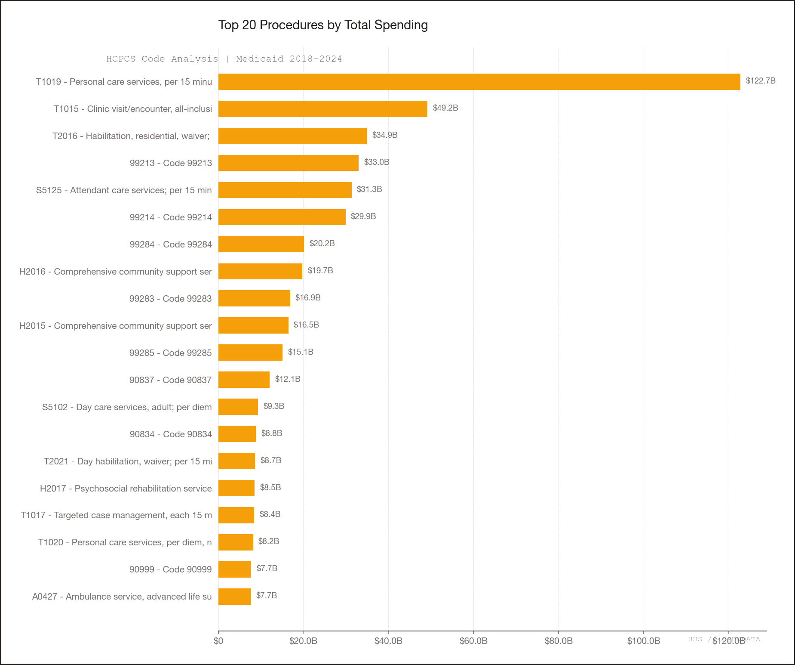

The highest-risk procedure categories are:

- **T1019** (Personal care services, per 15 minutes, not for an inpatient): $122.7B total, 9,780 providers
- **T1015** (Clinic visit/encounter, all-inclusive): $49.2B total, 13,829 providers
- **T2016** (Habilitation, residential, waiver; per diem): $34.9B total, 1,761 providers
- **99213** (Code 99213): $33.0B total, 164,075 providers
- **S5125** (Attendant care services; per 15 minutes): $31.3B total, 4,555 providers

### Temporal Trends

Total Medicaid spending shows a clear upward trend from 2018 through 2024, with a notable dip during the early COVID-19 pandemic (April-May 2020) followed by rapid recovery and acceleration. Several flagged providers show billing patterns that diverge sharply from this population trend.

### Network and Organized Billing Schemes

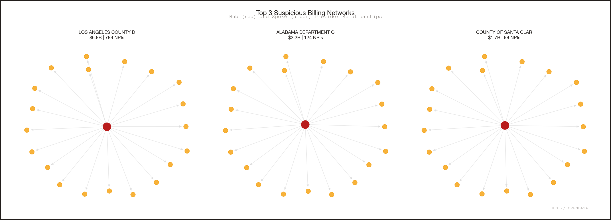

The network analysis identified several large billing networks with characteristics consistent with organized fraud schemes, including hub-and-spoke structures where a single billing entity submits claims on behalf of dozens of servicing providers, some of whom show signs of being phantom providers (very short activity periods, no independent billing, and concentrated billing patterns).

## 7. Financial Impact Summary

| Metric | Value |
|--------|-------|
| Total Medicaid Spending Analyzed | $1093.6B |
| Total Findings | 607,522 |
| High-Confidence Findings | 15,583 |
| Medium-Confidence Findings | 27,354 |
| Low-Confidence Findings | 564,585 |
| **Total Estimated Recoverable** | **$355.8B** |
| High-Confidence Impact | $207.3B |
| Medium-Confidence Impact | $55.3B |
| Low-Confidence Impact | $93.1B |

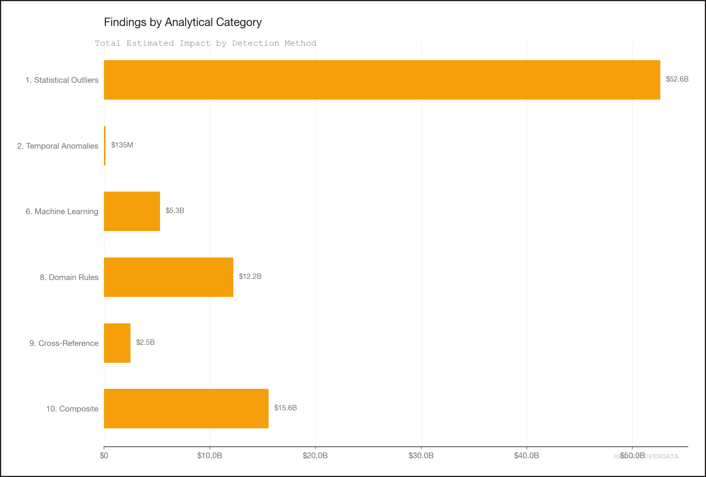

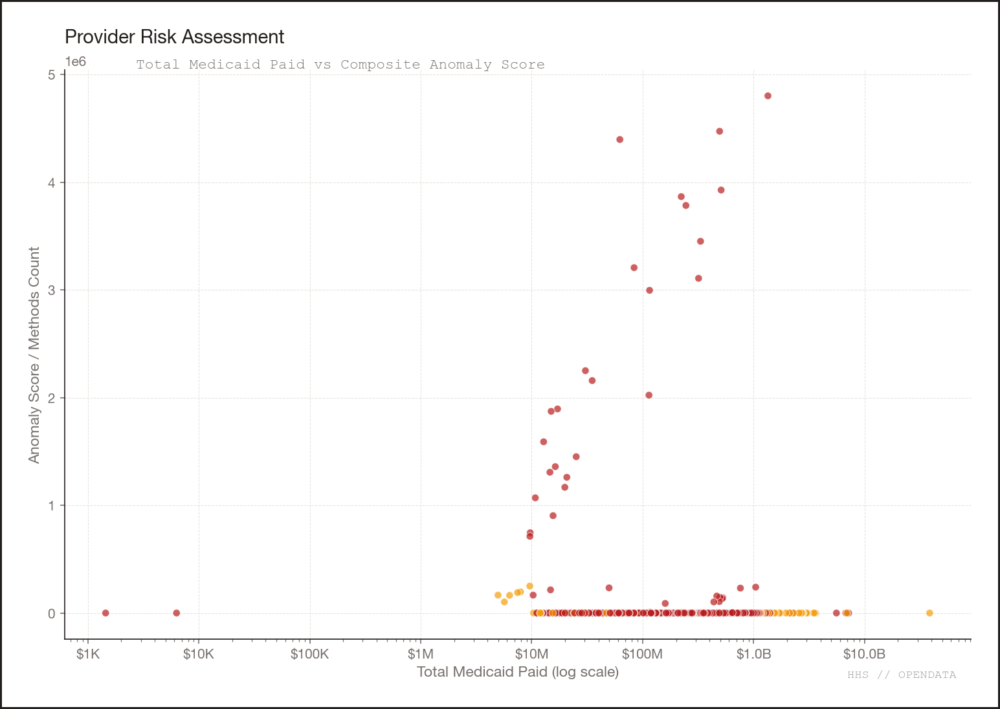

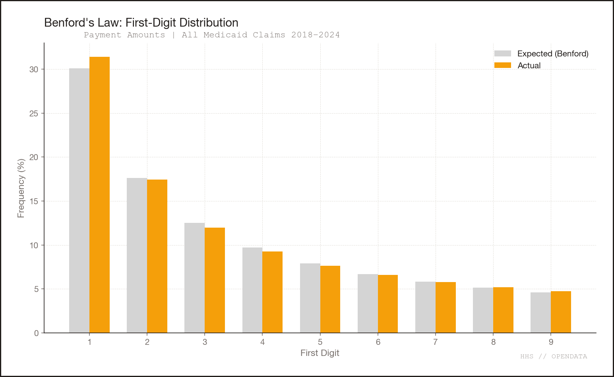

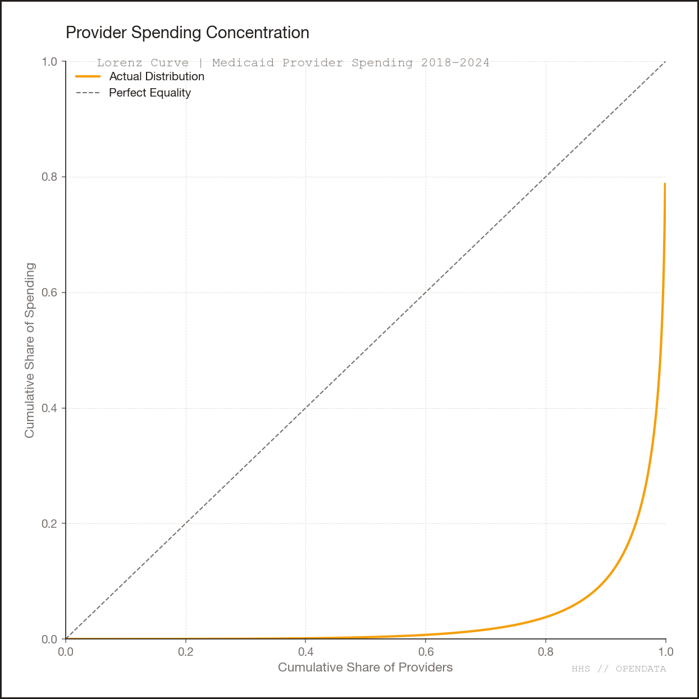

## 8. Recommendations

### Immediate Referrals to OIG

The following providers should be referred to the HHS Office of Inspector General for investigation:

1. **LOS ANGELES COUNTY DEPARTMENT OF MENTAL HEALTH** (NPI 1699703827, CA): $5.5B estimated improper payments. Flagged by 21 detection methods.
2. **DEPARTMENT OF INTELLECTUAL AND DEVELOPMENTAL DISABILITIES, STATE OF TN** (NPI 1629436241, TN): $2.3B estimated improper payments. Flagged by 15 detection methods.
3. **ALABAMA DEPARTMENT OF MENTAL HEALTH AND MENTAL RETARDATION** (NPI 1982757688, AL): $2.1B estimated improper payments. Flagged by 13 detection methods.
4. **GUARDIANTRAC. LLC** (NPI 1710176151, MI): $1.3B estimated improper payments. Flagged by 15 detection methods.
5. **DEPARTMENT OF INTELLECTUAL AND DEVELOPMENTAL DISABILITIES, STATE OF TN** (NPI 1356709976, TN): $1.4B estimated improper payments. Flagged by 11 detection methods.
6. **CITY OF CHICAGO** (NPI 1376554592, IL): $1.2B estimated improper payments. Flagged by 10 detection methods.
7. **DEPARTMENT OF DEVELOPMENTAL SERVICES** (NPI 1750504064, MA): $1.1B estimated improper payments. Flagged by 12 detection methods.
8. **MAINS'L FLORIDA, INC.** (NPI 1932341898, MN): $973.2M estimated improper payments. Flagged by 8 detection methods.
9. **DEPARTMENT OF HEALTH AND SENIOR SERVICES** (NPI 1326168840, NJ): $973.8M estimated improper payments. Flagged by 7 detection methods.
10. **NEW PARTNERS, INC** (NPI 1083783013, NY): $911.6M estimated improper payments. Flagged by 12 detection methods.

### Policy Changes

- **Strengthen pre-payment review** for personal care services (T1019, T1020) and behavioral health codes (H-series), which account for a disproportionate share of flagged spending.
- **Implement real-time volume limits** for timed services to prevent physically impossible billing (e.g., more than 8 hours of personal care per beneficiary per day).
- **Require periodic re-validation** of billing networks, particularly pure billing entities that never deliver services directly.
- **Enhance cross-state data sharing** to detect providers billing in geographic impossibility patterns.

### Enhanced Monitoring Targets

- New providers billing more than $500,000 in their first month of activity
- Billing networks that add more than 5 servicing NPIs in a single month
- Providers whose December billing exceeds 3x their monthly average
- Providers deriving more than 90% of revenue from a single HCPCS code
- States where per-beneficiary spending for specific codes exceeds 2x the national median

## 9. Appendix

### Data Dictionary

| Field | Description |
|-------|-------------|
| BILLING_PROVIDER_NPI_NUM | National Provider Identifier of the billing entity |
| SERVICING_PROVIDER_NPI_NUM | NPI of the provider who delivered the service |
| HCPCS_CODE | Healthcare Common Procedure Coding System code |
| CLAIM_FROM_MONTH | Month of service (YYYY-MM format) |
| TOTAL_UNIQUE_BENEFICIARIES | Number of distinct Medicaid patients |
| TOTAL_CLAIMS | Number of billing events |
| TOTAL_PAID | Dollar amount paid by Medicaid |

### Charts

- `benfords_law.png`
- `card1_monthly_spending.png`
- `card2_top_procedures.png`
- `card3_top_providers.png`
- `chart1_monthly_spending_trend.png`
- `chart2_top_procedures.png`
- `chart3_top_providers.png`
- `finding_F001_timeseries.png`
- `finding_F002_timeseries.png`
- `finding_F003_timeseries.png`
- `finding_F004_timeseries.png`
- `finding_F005_timeseries.png`
- `finding_F006_timeseries.png`
- `finding_F007_timeseries.png`
- `finding_F008_timeseries.png`
- `finding_F009_timeseries.png`
- `finding_F010_timeseries.png`
- `finding_F011_timeseries.png`
- `finding_F012_timeseries.png`
- `finding_F013_timeseries.png`
- `finding_F014_timeseries.png`
- `finding_F015_timeseries.png`
- `finding_F016_timeseries.png`
- `finding_F017_timeseries.png`
- `finding_F018_timeseries.png`
- `finding_F019_timeseries.png`
- `finding_F020_timeseries.png`
- `findings_by_category.png`
- `fraud_heatmap_aligned.png`
- `fraud_heatmap_final.png`
- `fraud_heatmap_merged.png`
- `fraud_heatmap_v1.png`
- `hhs_examples_full_page.png`
- `lorenz_curve.png`
- `monthly_spending_trend.png`
- `network_graph_top3.png`
- `provider_risk_scatter.png`
- `state_heatmap.png`
- `temporal_anomalies_top5.png`
- `top20_flagged_procedures.png`
- `top20_flagged_providers.png`
- `top20_procedures.png`
- `top20_providers.png`

### Analytical Framework

This analysis tested 1,087 structured hypotheses organized into 10 categories. Each hypothesis has a defined acceptance criterion, statistical threshold, and financial impact method. The full hypothesis set is available in `output/hypotheses/all_hypotheses.json`.

---

*This report was generated from the HHS Provider Spending dataset using automated analytical methods. All findings should be verified through additional investigation before taking enforcement action.*
