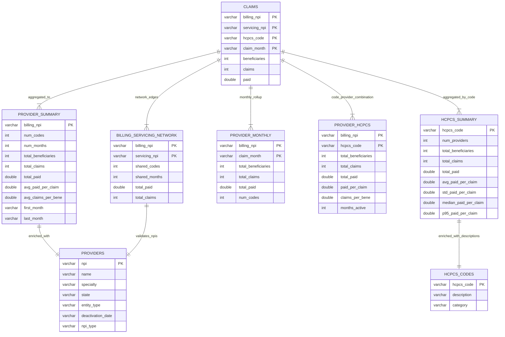

# Entity Relationship Diagram

This diagram shows the Medicaid fraud detection data model:

* **CLAIMS**: Raw fact table (227M rows) -- one row per billing_npi + servicing_npi + hcpcs_code + claim_month combination
* **Pre-aggregated summaries**: PROVIDER_SUMMARY, HCPCS_SUMMARY, PROVIDER_MONTHLY, PROVIDER_HCPCS, BILLING_SERVICING_NETWORK enable fast analytical queries
* **Reference enrichment**: PROVIDERS (with specialty, state, deactivation status), HCPCS_CODES (descriptions, categories)
* **Relationships**: Aggregations derive from CLAIMS; enrichment joins with reference tables

All ingestion occurs in Milestone 01. Summary tables pre-computed and cached. Downstream milestones query these tables for hypothesis execution and analysis.

## Testing & Validation

### Acceptance Tests

* **Table Schema**: Verify all 8 tables created with correct columns and types as shown in ERD
* **Primary Keys**: Verify primary key constraints defined on all tables
* **Data Types**: Verify NPIs stored as VARCHAR; dates as YYYY-MM VARCHAR; money as DOUBLE; counts as INTEGER
* **Relationships**: Verify foreign key relationships correct (aggregations, enrichment joins)
* **Aggregation Correctness**: Verify PROVIDER_SUMMARY totals match CLAIMS aggregates; verify HCPCS_SUMMARY statistics correct
* **Enrichment Completeness**: Verify PROVIDERS table includes all NPIs from CLAIMS; verify HCPCS_CODES includes all codes from CLAIMS
* **Index Presence**: Verify indexes created on frequently-queried columns
* **Query Performance**: Verify analytical queries execute within acceptable time

### Unit Tests

* **Table Creation**: Test CREATE TABLE statements execute without error
* **Index Creation**: Test index creation on primary keys and frequently-queried columns
* **Aggregation Logic**: Test summary table calculations on sample data
* **Data Type Validation**: Verify correct types stored in each column

### Integration Tests

* **Data Continuity**: Track sample provider through all tables (CLAIMS -> PROVIDER_SUMMARY, PROVIDER_MONTHLY, PROVIDER_HCPCS -> PROVIDERS enrichment)
* **Consistency Check**: Verify sums of PROVIDER_SUMMARY totals match CLAIMS aggregates; verify no duplicates in enrichment
* **Query Performance**: Execute representative analytical queries; verify acceptable speed
* **Relationship Validation**: Verify all aggregation and enrichment relationships work correctly

### Test Data Requirements

* **Full Claims Dataset**: 227M rows to populate all tables
* **Validation Data**: Manual calculations for spot-checking aggregates
* **Edge Cases**: NULL values, zero values, division-by-zero scenarios

### Success Criteria

* All 8 tables created with correct schema
* Primary keys and relationships defined
* Aggregations mathematically correct
* Enrichment complete for all entities
* Query performance adequate for analysis
* Data model supports all downstream analytical queries
