# System Architecture

```mermaid
graph LR
    subgraph "Data Ingestion Pipeline"
        DQSCAN["M00: Data Quality Scan"]
        INGEST["M01: Claims Ingestion"]
        ENRICH["M02: Reference Enrichment"]
    end

    subgraph "Analysis & Hypothesis"
        EDA["M03: Exploratory Analysis"]
        HYPGEN["M04: Hypothesis Generation"]
        STAT["M05-08: Detection Execution"]
        ML["M06: ML Anomaly Detection"]
        DOMAIN["M08: Domain Rules"]
        CROSS["M09: Cross-Reference"]
    end

    subgraph "Validation & Scoring"
        DEDUP["M09: Deduplication"]
        LONGPANEL["M13: Longitudinal Panels"]
        HOLDOUT["M14: Holdout Validation"]
        QUALITY["M15: Quality Weighting"]
        SCORES["M23: Provider Scores"]
    end

    subgraph "Impact & Prioritization"
        IMPACT["M09: Financial Impact"]
        QUEUE["M16: Risk Queue"]
        PATTERNS["M21: Pattern Classification"]
        ACTIONS["M22: Action Plans"]
    end

    subgraph "Reporting & Visualization"
        CHARTS["M10: Chart Generation"]
        REPORT["M11: CMS Report"]
        CARDS["M17-20: Cards/Brief"]
        MERGED["M20: Merged Cards"]
    end

    subgraph "Data Storage"
        DDB[(DuckDB Database)]
        OUTPUT[("Output Files")]
    end

    DQSCAN --> INGEST
    INGEST --> ENRICH
    ENRICH --> EDA
    EDA --> HYPGEN
    HYPGEN --> STAT
    STAT --> ML
    DOMAIN --> CROSS
    ML --> DEDUP
    CROSS --> DEDUP
    DEDUP --> IMPACT
    IMPACT --> QUALITY
    QUALITY --> SCORES
    SCORES --> QUEUE
    QUEUE --> ACTIONS
    LONGPANEL --> HOLDOUT
    HOLDOUT --> SCORES
    STAT --> CHARTS
    CHARTS --> REPORT
    REPORT --> CARDS
    CARDS --> MERGED
    MERGED --> OUTPUT
    QUEUE --> OUTPUT
    ACTIONS --> OUTPUT
    PATTERNS --> ACTIONS
```

## System Architecture Overview

The Medicaid fraud detection pipeline is a 24-milestone, sequential data processing system:

### Data Ingestion (Green) -- Milestones 00-02

Load claims CSV, validate quality, ingest to DuckDB, enrich with NPPES/HCPCS reference data.

### Analysis & Hypotheses (Blue) -- Milestones 03-09

Perform exploratory analysis, generate fraud detection hypotheses, execute statistical, temporal, peer, network, ML, domain rule, and cross-reference detection methods.

### Validation & Scoring (Red) -- Milestones 13-23

Construct longitudinal panels, run holdout validation, calibrate confidence scores, apply quality weighting, calculate composite provider validation scores.

### Impact & Prioritization (Orange) -- Milestones 09-22

Deduplicate overlapping findings, quantify financial impact, classify fraud patterns, generate risk-prioritized investigation queues and action plans.

### Reporting & Visualization (Yellow) -- Milestones 10-20

Generate HHS-styled charts, comprehensive CMS report, executive dashboard cards, hypothesis cards, executive brief, and action plan documents.

### Persistent Storage (Purple)

DuckDB database persists between milestones; output files saved to structured output/ directory.

**Key Architectural Principles:**

* **Sequential Execution**: Each milestone depends on predecessors; no parallelization
* **Idempotency**: Rerunning produces identical outputs for identical inputs
* **Failure Isolation**: Individual hypothesis failures logged and processing continues
* **Read-Only Analysis**: All hypothesis execution uses read-only database access
* **Progressive Enrichment**: Data flows left-to-right; each stage adds value

## Testing & Validation

### Acceptance Tests

* **Sequential Execution**: Verify all 24 milestones execute in documented order
* **Data Flow**: Verify outputs from each stage consumed by successors
* **Storage**: Verify DuckDB persists; verify output files organized

### Integration Tests

* **Full Pipeline**: Run all 24 milestones end-to-end -> verify all outputs
* **Data Continuity**: Track sample provider through all stages
* **Idempotency**: Run twice; verify identical outputs

### Success Criteria

* All 24 milestones execute sequentially and successfully
* Data flows correctly from one stage to next
* DuckDB persists and enables recovery
* Output files organized per specification
* Rerunning produces identical results
